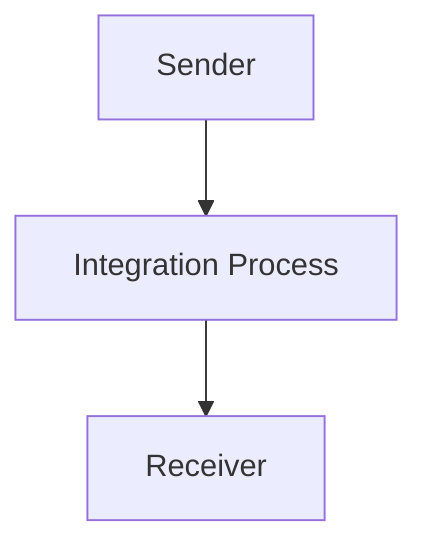

SAP / motiveminds
\n\n\n\n\n\n<h1 style="color: #1f4e79; font-size: 3em; text-align: left; margin-top: 100px;">AI Tech Specification Project - Odata_Mass_PDF_upload</h1>\n\n\n\n\n\n| Key | Value |\n| :--- | :--- |\n| Author | Nidhi Srivastava |\n| Date | 2025-12-01 |\n| Version | Draft |\n\n\n\n\n\n\n\n\n\n\n\n\n\n\n\n\n\n\n\n\n\n\n\n<h1 style="color: #1f4e79; font-size: 2.5em;">Table of Contents</h1>

1. Introduction  
    1.1 Purpose  
    1.2 Scope  
2. Integration Overview  
    2.1 Integration Architecture  
    2.2 Integration Components  
3. Integration Scenarios  
    3.1 Scenario Description  
    3.2 Data Flows  
    3.3 Security Requirements  
4. Error Handling and Logging  
5. Testing Validation  
6. Reference Documents  

          

# 1. Introduction

## 1.1 Purpose
The purpose of the iFlow 'Odata_Mass_PDF_upload' is to facilitate the mass upload of PDF documents through an OData service. This integration flow is designed to streamline the process of handling PDF files, ensuring that they are correctly processed and stored in the target system.

## 1.2 Scope
This iFlow operates within the SAP Cloud Platform Integration (CPI) environment and interacts with various systems, including the source system that generates the PDF documents and the target system where these documents are stored. The boundaries of this iFlow include the data transformation and routing of PDF files, as well as error handling and logging mechanisms.

# 2. Integration Overview

## 2.1 Integration Architecture
The integration architecture for the 'Odata_Mass_PDF_upload' iFlow consists of a sender and a receiver, with an integration process that manages the flow of data. The sender initiates the process by sending PDF documents, which are then processed and forwarded to the receiver.

## 2.2 Integration Components
- **Sender System**: The system that generates and sends the PDF documents to the iFlow.
- **Receiver System**: The target system where the PDF documents are stored.
- **Adapter Types Used**: The iFlow utilizes HTTP adapters for both sending and receiving data.

# 3. Integration Scenarios

## 3.1 Scenario Description
The integration scenario begins with the sender system triggering the iFlow by sending a request containing the PDF documents. The integration process then handles the incoming data, performing necessary transformations and validations before forwarding the documents to the receiver system.

## 3.2 Data Flows
The data flow involves the following steps:
1. The sender sends a request with PDF documents.
2. The integration process receives the request and processes the PDF files.
3. The processed PDF files are sent to the receiver system for storage.

### Mapping Logic Summary
The iFlow may include XSLT or other mapping logic to transform the incoming data format into the required format for the receiver system.

### Groovy Script Explanations
If Groovy scripts are utilized, they serve to perform complex transformations or validations that cannot be achieved through standard mapping techniques. The purpose of these scripts is to ensure that the data adheres to the required structure before being sent to the receiver.

## 3.3 Security Requirements
The iFlow implements security measures to protect the data being transmitted. This includes:
- **Authentication**: Basic authentication is not enabled for the sender, but it can be configured if required.
- **Transport Security**: HTTPS should be used to secure data in transit.
- **Credentials Management**: Proper management of credentials is essential for accessing both sender and receiver systems.

# 4. Error Handling and Logging
Error handling is a critical aspect of the iFlow. The integration process is designed to capture and log errors that occur during the data processing stages. This includes:
- Logging errors to a central logging system for monitoring and troubleshooting.
- Implementing retry mechanisms for transient errors to ensure data integrity.

# 5. Testing Validation
Key testing scenarios for the iFlow include:
- Validating the successful upload of PDF documents.
- Testing error handling by simulating failures in the sender or receiver systems.
- Ensuring that data transformations are correctly applied and that the receiver system receives the expected data format.

# 6. Reference Documents
The following artifacts were analyzed to create this documentation:
- iFlow Content: `Odata_Mass_PDF_upload.iflw`
- Groovy scripts (if applicable)
- XSLT files (if applicable)
