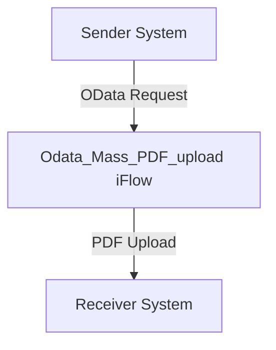

SAP / motiveminds
\n\n\n\n\n\n<h1 style="color: #1f4e79; font-size: 3em; text-align: left; margin-top: 100px;">AI Tech Specification Project - Odata_Mass_PDF_upload</h1>\n\n\n\n\n\n| Key | Value |\n| :--- | :--- |\n| Author | Nidhi Srivastava |\n| Date | 2025-12-01 |\n| Version | Draft |\n\n\n\n\n\n\n\n\n\n\n\n\n\n\n\n\n\n\n\n\n\n\n\n<h1 style="color: #1f4e79; font-size: 2.5em;">Table of Contents</h1>

1. Introduction  
    1.1 Purpose  
    1.2 Scope  
2. Integration Overview  
    2.1 Integration Architecture  
    2.2 Integration Components  
3. Integration Scenarios  
    3.1 Scenario Description  
    3.2 Data Flows  
    3.3 Security Requirements  
4. Error Handling and Logging  
5. Testing Validation  
6. Reference Documents  

          

# 1. Introduction

## 1.1 Purpose
The purpose of the iFlow 'Odata_Mass_PDF_upload' is to facilitate the mass upload of PDF documents via OData services. This integration flow is designed to streamline the process of handling multiple PDF files, ensuring they are correctly processed and stored in the target system.

## 1.2 Scope
This iFlow operates within the SAP Cloud Platform Integration (CPI) environment and interacts with both sender and receiver systems. The primary systems affected include the source OData service that provides the PDF files and the target system where these files are stored. The iFlow is responsible for managing the data transfer, ensuring data integrity, and handling any errors that may arise during the process.

# 2. Integration Overview

## 2.1 Integration Architecture
The integration architecture for the 'Odata_Mass_PDF_upload' iFlow consists of a sender and a receiver, with an integration process that manages the flow of data between them. The architecture is designed to ensure efficient data handling and error management.

## 2.2 Integration Components
The integration components of this iFlow include:

- **Sender System**: The source of the PDF files, which communicates with the iFlow via OData.
- **Receiver System**: The destination where the PDF files are uploaded.
- **Adapters**: The iFlow utilizes OData adapters for communication with the sender and receiver systems.

# 3. Integration Scenarios

## 3.1 Scenario Description
The integration scenario begins with the sender system triggering an OData request to the iFlow. The iFlow processes the incoming request, retrieves the PDF files, and subsequently uploads them to the receiver system. The flow is straightforward, consisting of a start event, processing logic, and an end event.

## 3.2 Data Flows
The data flow within the iFlow involves the following steps:

1. **Incoming OData Request**: The iFlow receives a request containing the PDF files.
2. **Processing Logic**: The iFlow processes the incoming data, ensuring that the files are correctly formatted and ready for upload.
3. **Upload to Receiver**: The processed PDF files are sent to the receiver system for storage.

Currently, there are no specific XSLT mappings or Groovy scripts detailed in the provided artifacts for this iFlow.

## 3.3 Security Requirements
The security configuration for the iFlow includes:

- **Basic Authentication**: The sender system does not require basic authentication as indicated by the configuration.
- **Transport Security**: It is assumed that secure transport protocols (HTTPS) are used for data transmission, although specific configurations are not detailed in the provided artifacts.

# 4. Error Handling and Logging
Error handling within the iFlow is managed through the configuration settings. The property `returnExceptionToSender` is set to false, indicating that exceptions will not be returned to the sender. Instead, errors will be logged for further analysis. The iFlow does not specify a detailed error strategy, which may require additional implementation based on operational needs.

# 5. Testing Validation
Key testing scenarios for the iFlow include:

- **Successful PDF Upload**: Validate that the iFlow correctly processes and uploads PDF files from the sender to the receiver.
- **Error Handling**: Test the iFlow's response to invalid PDF formats or connection issues with the receiver system.
- **Performance Testing**: Assess the iFlow's performance when handling multiple PDF uploads simultaneously.

# 6. Reference Documents
The following artifacts were analyzed for the creation of this documentation:

- iFlow Content: `Odata_Mass_PDF_upload.iflw`
