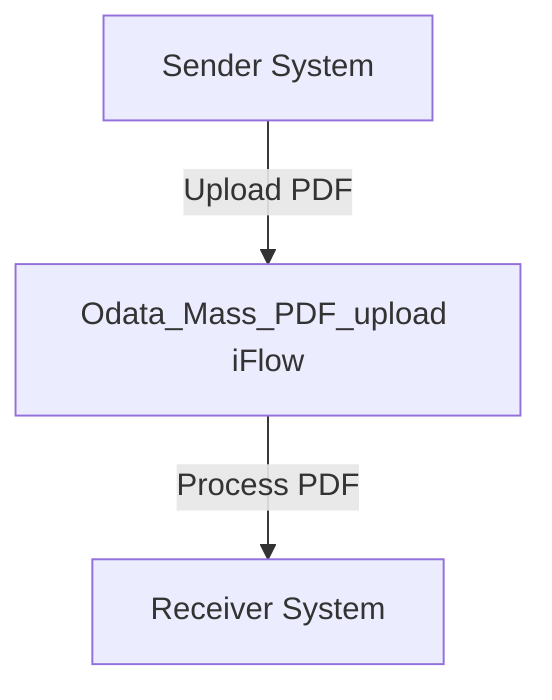

\n\n\n\n\n\n\n<h1 style="color: #1f4e79; font-size: 3em; text-align: left; margin-top: 100px;">AI Tech Specification Project - Odata Mass PDF upload - Odata Mass PDF upload</h1>\n\n\n\n\n\n\n\n\n\n\n\n\n| Key | Value |\n| :--- | :--- |\n| Author | Nidhi Srivastava |\n| Date | 2025-12-01 |\n| Version | Draft |\n\n\n\n\n\n\n\n\n\n\n\n\n\n\n\n\n\n\n\n\n\n\n\n<h1 style="color: #1f4e79; font-size: 2.5em;">Table of Contents</h1>

1. Introduction  
    1.1 Purpose  
    1.2 Scope  

2. Integration Overview  
    2.1 Integration Architecture  
    2.2 Integration Components  

3. Integration Scenarios  
    3.1 Scenario Description  
    3.2 Data Flows  
    3.3 Security Requirements  

4. Error Handling and Logging  

5. Testing Validation  

6. Reference Documents  

# 1. Introduction

## 1.1 Purpose
The purpose of the iFlow 'Odata_Mass_PDF_upload' is to facilitate the mass upload of PDF documents into an OData service. This integration flow is designed to streamline the process of transferring multiple PDF files from a sender system to a receiver system, ensuring that the documents are correctly processed and stored.

## 1.2 Scope
This iFlow operates within the SAP Cloud Platform Integration (CPI) environment and interacts with both sender and receiver systems. The sender system is responsible for initiating the upload of PDF files, while the receiver system is tasked with processing and storing these files. The iFlow does not handle any transformations or complex business logic beyond the basic upload functionality.

# 2. Integration Overview

## 2.1 Integration Architecture
The integration architecture for the 'Odata_Mass_PDF_upload' iFlow consists of a sender and a receiver, with a straightforward process flow that initiates and completes the upload of PDF documents.

## 2.2 Integration Components
- **Sender System**: This is the system that initiates the upload of PDF files.
- **Receiver System**: This is the target system where the PDF files are processed and stored.
- **Adapter Types Used**: The iFlow utilizes HTTP adapters for communication between the sender and receiver systems.

# 3. Integration Scenarios

## 3.1 Scenario Description
The integration scenario begins with the sender system triggering the iFlow to upload PDF documents. The iFlow receives the documents, processes them, and forwards them to the receiver system for storage. The flow is initiated by a start event and concludes with an end event, ensuring that the process is completed successfully.

## 3.2 Data Flows
The iFlow does not include complex data transformations or mappings, as its primary function is to facilitate the upload of PDF files. The data flow is straightforward, with the PDF files being sent directly from the sender to the receiver without any intermediate processing.

## 3.3 Security Requirements
The iFlow is configured with basic security settings. The sender does not require basic authentication, and there are no specific security credentials or mechanisms detailed in the configuration. The iFlow is designed to operate without enabling CORS or allowing credentials, ensuring a simplified security model.

# 4. Error Handling and Logging
Error handling is not explicitly defined within the iFlow configuration. However, the iFlow is set to not return exceptions to the sender, which implies that any errors encountered during processing may not be communicated back to the initiating system. Logging mechanisms are not detailed, suggesting that standard logging practices should be followed to capture any issues that arise during execution.

# 5. Testing Validation
Key testing scenarios for the 'Odata_Mass_PDF_upload' iFlow include:
- Validating the successful upload of PDF files from the sender to the receiver.
- Ensuring that the receiver system correctly processes and stores the uploaded files.
- Testing the iFlow's behavior under various conditions, such as network failures or invalid file formats.

# 6. Reference Documents
- iFlow Content: `Odata_Mass_PDF_upload.iflw`
