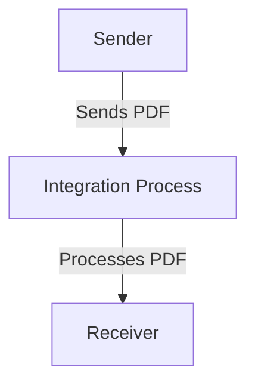

<h1 style="color: #1f4e79; font-size: 3em; text-align: center; margin-top: 5px; margin-bottom: 5px;">Odata Mass PDF upload</h1><h2 style="color: #1f4e79; font-size: 1.5em; text-align: center; margin-top: 5px; margin-bottom: 0px;">SAP CPI Technical Specification Document</h2>

<table border="1" style="width: 400px; border-collapse: collapse; border-color: black; margin: 0 auto; text-align: left;">
  <tr><td style="width: 30%; padding: 5px;">**Author:**</td><td style="padding: 5px;">Rohancherian783</td></tr>
  <tr><td style="padding: 5px;">**Date:**</td><td style="padding: 5px;">2025-12-11</td></tr>
  <tr><td style="padding: 5px;">**Version (Commit):**</td><td style="padding: 5px;">709cd68</td></tr>
</table>

<h1 style="color: #1f4e79; font-size: 2.5em;">Table of Contents</h1>

1. Introduction  
    1.1 Purpose  
    1.2 Scope  
2. Integration Overview  
    2.1 Integration Architecture  
    2.2 Integration Components  
3. Integration Scenarios  
    3.1 Scenario Description  
    3.2 Data Flows  
    3.3 Security Requirements  
4. Error Handling and Logging  
5. Testing Validation  
6. Reference Documents  

# 1. Introduction

## 1.1 Purpose
The purpose of the iFlow 'Odata_Mass_PDF_upload' is to facilitate the mass upload of PDF documents through an OData service. This integration flow is designed to streamline the process of handling PDF files, ensuring that they are correctly processed and uploaded to the target system.

## 1.2 Scope
This iFlow interacts with various systems, primarily focusing on the sender and receiver endpoints defined within the integration process. The scope includes the handling of PDF files, their transformation, and the subsequent upload to the designated receiver system. The iFlow is limited to processing PDF documents and does not encompass other file types or formats.

# 2. Integration Overview

## 2.1 Integration Architecture
The integration architecture for the 'Odata_Mass_PDF_upload' iFlow consists of a sender and a receiver, with an integration process that manages the flow of data between them. The architecture is designed to ensure efficient handling of PDF uploads via OData.

## 2.2 Integration Components
The integration components include:
- **Sender**: This is the endpoint that initiates the upload of PDF documents.
- **Receiver**: This endpoint is responsible for receiving the processed PDF files.
- **Adapters**: The iFlow utilizes OData adapters to facilitate communication between the sender and receiver systems.

# 3. Integration Scenarios

## 3.1 Scenario Description
The integration scenario begins with the sender initiating a request to upload a PDF document. The integration process captures this request, processes the PDF, and forwards it to the receiver. The flow is straightforward, with a start event triggering the process and an end event marking its completion.

## 3.2 Data Flows
The data flow involves the following steps:
1. The sender sends a PDF document to the integration process.
2. The integration process may include transformation logic (not detailed in the provided artifacts).
3. The processed PDF is sent to the receiver.

Currently, there are no specific XSLT or mapping files provided in the artifacts, nor are there detailed Groovy scripts included in the analysis. The integration relies on the basic flow defined in the iFlow.

## 3.3 Security Requirements
The iFlow configuration indicates that basic authentication is not enabled for the sender. Security measures should be considered to ensure that the PDF uploads are secure, including potential use of HTTPS and other authentication mechanisms as required by the receiving system.

# 4. Error Handling and Logging
Error handling is not explicitly detailed in the provided artifacts. However, it is essential to implement logging mechanisms to capture any errors that occur during the PDF upload process. This can include logging the start and end of the process, as well as any exceptions that may arise.

# 5. Testing Validation
Key testing scenarios for the iFlow include:
- Validating successful uploads of PDF documents.
- Testing the integration process with various PDF sizes and formats.
- Ensuring that error handling works correctly when invalid data is sent.

# 6. Reference Documents
The following artifacts were analyzed for this report:
- `Odata_Mass_PDF_upload.iflw` (iFlow configuration file)
