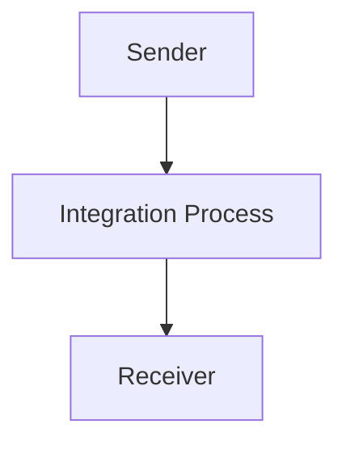

<h1 style="color: #1f4e79; font-size: 3em; text-align: center; margin-top: 5px; margin-bottom: 5px;">Odata Mass PDF upload</h1><h2 style="color: #1f4e79; font-size: 1.5em; text-align: center; margin-top: 5px; margin-bottom: 0px;">SAP CPI Technical Specification Document</h2>

<table border="1" style="width: 400px; border-collapse: collapse; border-color: black; margin: 0 auto; text-align: left;"><tr><td style="width: 30%; padding: 5px;">**Author:**</td><td style="padding: 5px;">Rohancherian783</td></tr><tr><td style="padding: 5px;">**Date:**</td><td style="padding: 5px;">2025-12-11</td></tr><tr><td style="padding: 5px;">**Version (Commit):**</td><td style="padding: 5px;">1c39c43</td></tr></table>

<h1 style="color: #1f4e79; font-size: 2.5em;">Table of Contents</h1>

1. Introduction  
   1.1 Purpose  
   1.2 Scope  
2. Integration Overview  
   2.1 Integration Architecture  
   2.2 Integration Components  
3. Integration Scenarios  
   3.1 Scenario Description  
   3.2 Data Flows  
   3.3 Security Requirements  
4. Error Handling and Logging  
5. Testing Validation  
6. Reference Documents  

<h1 style="color: #1f4e79;">1. Introduction</h1>

<h2 style="color: #1f4e79;">1.1 Purpose</h2>  
The purpose of the iFlow 'Odata_Mass_PDF_upload' is to facilitate the mass upload of PDF documents through an OData service. This integration flow is designed to streamline the process of handling multiple PDF files, ensuring they are processed efficiently and effectively within the SAP ecosystem.

<h2 style="color: #1f4e79;">1.2 Scope</h2>  
This iFlow operates within the SAP Cloud Platform Integration (CPI) environment and interacts with various systems that support OData services. The primary systems affected include the sender system that initiates the PDF upload and the receiver system that processes the uploaded documents. The iFlow is limited to handling PDF files and does not extend to other document types.

<h1 style="color: #1f4e79;">2. Integration Overview</h1>

<h2 style="color: #1f4e79;">2.1 Integration Architecture</h2>  
The integration architecture for the 'Odata_Mass_PDF_upload' iFlow consists of a sender and a receiver, with an integration process that manages the flow of data between them. The architecture is designed to ensure seamless communication and data transfer.

<h2 style="color: #1f4e79;">2.2 Integration Components</h2>  
The integration components of this iFlow include:
- **Sender**: An endpoint that initiates the PDF upload process.
- **Receiver**: An endpoint that receives and processes the uploaded PDF documents.
- **Adapters**: The iFlow utilizes HTTP adapters for both sending and receiving data.

<h1 style="color: #1f4e79;">3. Integration Scenarios</h1>

<h2 style="color: #1f4e79;">3.1 Scenario Description</h2>  
The integration scenario begins with the sender system triggering the upload of multiple PDF files. The iFlow captures these files and processes them through the integration process, ultimately sending them to the receiver system for further handling.

<h2 style="color: #1f4e79;">3.2 Data Flows</h2>  
The data flow within the iFlow involves the following steps:
1. The sender system sends a request to upload PDF files.
2. The integration process receives the request and processes the files.
3. The processed files are then sent to the receiver system.

The iFlow may include mapping logic to ensure that the data format aligns with the requirements of the receiver system. However, specific XSLT or mapping details were not provided in the artifacts.

<h2 style="color: #1f4e79;">3.3 Security Requirements</h2>  
The iFlow configuration indicates that basic authentication is not enabled for the sender endpoint. Security measures should be implemented to ensure that only authorized users can initiate the PDF upload process. This may include the use of OAuth tokens or other authentication mechanisms as required by the organization’s security policies.

<h1 style="color: #1f4e79;">4. Error Handling and Logging</h1>  
Error handling within the iFlow is configured to not return exceptions to the sender. This means that any errors encountered during the processing of PDF uploads will not be communicated back to the sender system. It is essential to implement logging mechanisms to capture errors for troubleshooting and monitoring purposes.

<h1 style="color: #1f4e79;">5. Testing Validation</h1>  
Key testing scenarios for the 'Odata_Mass_PDF_upload' iFlow include:
- Validating the successful upload of multiple PDF files.
- Ensuring that the receiver system correctly processes the uploaded files.
- Testing the error handling mechanisms to confirm that errors are logged appropriately.

<h1 style="color: #1f4e79;">6. Reference Documents</h1>  
The following artifacts were analyzed for the creation of this report:
- iFlow Content: Odata_Mass_PDF_upload.iflw
- Integration architecture and process definitions.

