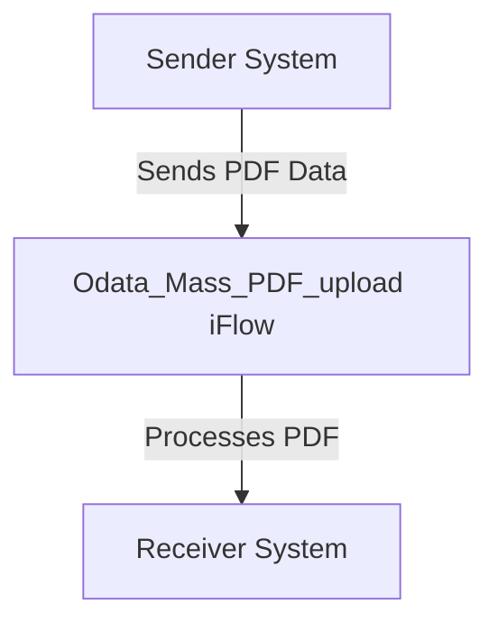

SAP / motiveminds
\n\n\n\n\n\n<h1 style="color: #1f4e79; font-size: 3em; text-align: left; margin-top: 100px;">AI Tech Specification Project - Odata Mass PDF upload - Odata Mass PDF upload</h1>\n\n\n\n\n\n\n\n\n\n\n\n\n| Key | Value |\n| :--- | :--- |\n| Author | Nidhi Srivastava |\n| Date | 2025-12-01 |\n| Version | Draft |\n\n\n\n\n\n\n\n\n\n\n\n\n\n\n\n\n\n\n\n\n\n\n\n<h1 style="color: #1f4e79; font-size: 2.5em;">Table of Contents</h1>

1. Introduction  
    1.1 Purpose  
    1.2 Scope  
2. Integration Overview  
    2.1 Integration Architecture  
    2.2 Integration Components  
3. Integration Scenarios  
    3.1 Scenario Description  
    3.2 Data Flows  
    3.3 Security Requirements  
4. Error Handling and Logging  
5. Testing Validation  
6. Reference Documents  

          

# 1. Introduction

## 1.1 Purpose
The purpose of the iFlow 'Odata_Mass_PDF_upload' is to facilitate the mass upload of PDF documents through an OData service. This integration flow is designed to streamline the process of handling PDF files, ensuring that they are correctly processed and stored in the target system.

## 1.2 Scope
This iFlow operates within the SAP Cloud Platform Integration (CPI) environment and interacts with various systems, including the sender system that initiates the PDF upload and the receiver system that processes and stores the uploaded PDFs. The boundaries of this iFlow are defined by its ability to handle PDF files and the OData service endpoints involved in the upload process.

# 2. Integration Overview

## 2.1 Integration Architecture
The integration architecture for the 'Odata_Mass_PDF_upload' iFlow consists of a sender and a receiver, with an integration process that manages the flow of data between these two endpoints. The architecture is designed to ensure efficient data transfer and processing.

## 2.2 Integration Components
The integration components of this iFlow include:
- **Sender System**: The system that initiates the PDF upload.
- **Receiver System**: The system that receives and processes the uploaded PDFs.
- **Adapters**: The iFlow utilizes OData adapters for communication between the sender and receiver systems.

# 3. Integration Scenarios

## 3.1 Scenario Description
The integration scenario begins when the sender system triggers the iFlow by sending a request to upload PDF documents. The iFlow processes the incoming request, handles the PDF data, and forwards it to the receiver system for storage and further processing.

## 3.2 Data Flows
The data flow within the iFlow involves the following steps:
1. The sender system sends a request containing the PDF data to the iFlow.
2. The iFlow processes the incoming data, ensuring it is in the correct format for the receiver system.
3. The processed PDF data is then sent to the receiver system for storage.

The iFlow may include mapping logic to transform the incoming data into the required format for the receiver system.

## 3.3 Security Requirements
Security for this iFlow is managed through the following mechanisms:
- **Authentication**: Basic authentication is not enabled for the sender endpoint, as indicated in the configuration.
- **Data Protection**: The iFlow ensures that sensitive data is handled securely during the upload process.

# 4. Error Handling and Logging
Error handling within the iFlow is configured to manage exceptions that may occur during the PDF upload process. The iFlow is set to not return exceptions to the sender, allowing for internal handling of errors without exposing them to the initiating system. Logging mechanisms are in place to capture relevant information for troubleshooting.

# 5. Testing Validation
Key testing scenarios for the iFlow include:
- Validating successful PDF uploads from the sender system to the receiver system.
- Testing error handling by simulating failures in the upload process.
- Ensuring that the data transformation and mapping logic function correctly.

# 6. Reference Documents
The following artifacts were analyzed to create this documentation:
- iFlow Content: `Odata_Mass_PDF_upload.iflw`
