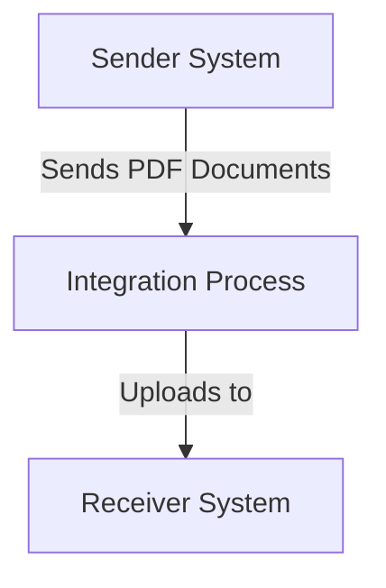

SAP / motiveminds
\n\n\n\n\n\n<h1 style="color: #1f4e79; font-size: 3em; text-align: left; margin-top: 100px;">AI Tech Specification Project - Odata_Mass_PDF_upload</h1>\n\n\n\n\n\n| Key | Value |\n| :--- | :--- |\n| Author | Nidhi Srivastava |\n| Date | 2025-12-01 |\n| Version | Draft |\n\n\n\n\n\n\n\n\n\n\n\n\n\n\n\n\n\n\n\n\n\n\n\n<h1 style="color: #1f4e79; font-size: 2.5em;">Table of Contents</h1>

1. Introduction  
    1.1 Purpose  
    1.2 Scope  
2. Integration Overview  
    2.1 Integration Architecture  
    2.2 Integration Components  
3. Integration Scenarios  
    3.1 Scenario Description  
    3.2 Data Flows  
    3.3 Security Requirements  
4. Error Handling and Logging  
5. Testing Validation  
6. Reference Documents  

  

# 1. Introduction

## 1.1 Purpose
The purpose of the iFlow 'Odata_Mass_PDF_upload' is to facilitate the mass upload of PDF documents through an OData service. This integration flow is designed to streamline the process of handling multiple PDF files, ensuring they are correctly processed and stored in the target system.

## 1.2 Scope
This iFlow operates within the SAP Cloud Platform Integration (CPI) environment and interacts with both sender and receiver systems. The primary systems affected by this iFlow include the source system that generates the PDF documents and the target system where these documents are uploaded. The iFlow is responsible for managing the data transfer, ensuring data integrity, and handling any errors that may arise during the upload process.

# 2. Integration Overview

## 2.1 Integration Architecture
The integration architecture for the 'Odata_Mass_PDF_upload' iFlow consists of a sender and a receiver, with an integration process that manages the flow of data between them. The sender initiates the process by sending PDF documents, which are then processed and uploaded to the receiver system.

## 2.2 Integration Components
The integration components of this iFlow include:

- **Sender System**: The system that generates and sends the PDF documents.
- **Receiver System**: The target system where the PDF documents are uploaded.
- **Adapters Used**: The iFlow utilizes HTTP adapters for both sending and receiving data, ensuring seamless communication between the systems.

# 3. Integration Scenarios

## 3.1 Scenario Description
The integration scenario begins with the sender system generating multiple PDF documents. These documents are sent to the integration process, which handles the upload to the receiver system. The process includes validation checks to ensure that the documents meet the required specifications before they are uploaded.

## 3.2 Data Flows
The data flow within the iFlow involves the following steps:

1. **Receiving PDF Documents**: The integration process receives the PDF documents from the sender system.
2. **Validation**: Each document is validated to ensure it meets the necessary criteria.
3. **Uploading**: Validated documents are uploaded to the receiver system.

The mapping logic for this iFlow is primarily handled through the integration process, which may include XSLT transformations if necessary. However, specific XSLT files were not provided in the artifacts.

### Groovy Script Explanations
Currently, there are no Groovy scripts included in the provided artifacts for this iFlow. If Groovy scripts were present, they would typically be used for custom processing or validation of the incoming data.

## 3.3 Security Requirements
The security configuration for this iFlow includes:

- **Basic Authentication**: The sender system does not enable basic authentication, as indicated in the configuration.
- **Transport Security**: It is assumed that HTTPS is used for secure data transmission, although specific configurations were not detailed in the artifacts.
- **Access Control**: The iFlow does not allow credentials for cross-origin requests, ensuring that only authorized systems can interact with the integration flow.

# 4. Error Handling and Logging
Error handling within the iFlow is managed through the integration process. The configuration specifies that exceptions are not returned to the sender, which implies that errors are logged internally for further analysis. The iFlow may include mechanisms to handle specific error scenarios, although detailed error handling logic was not provided in the artifacts.

# 5. Testing Validation
Key testing requirements for the 'Odata_Mass_PDF_upload' iFlow include:

- **Functional Testing**: Ensuring that PDF documents are correctly uploaded to the receiver system.
- **Performance Testing**: Validating the iFlow's ability to handle multiple PDF uploads simultaneously without degradation in performance.
- **Error Handling Testing**: Simulating error scenarios to ensure that the iFlow handles exceptions gracefully and logs them appropriately.

# 6. Reference Documents
The following input artifacts were analyzed for the creation of this documentation:

- `Odata_Mass_PDF_upload.iflw` (iFlow configuration file)
