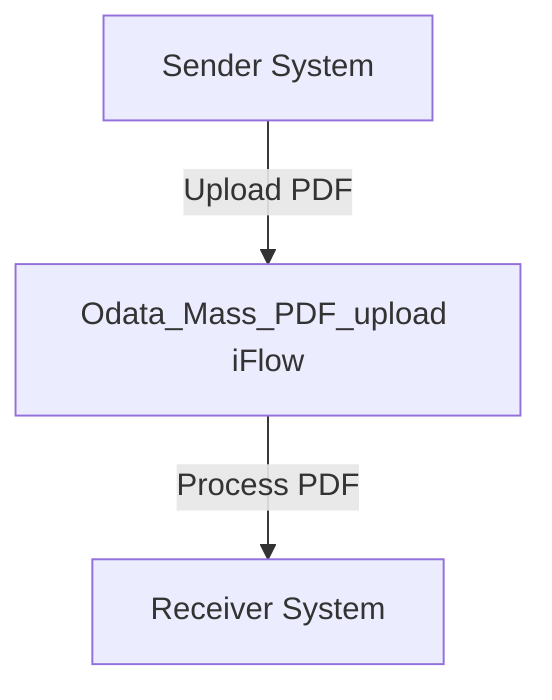

\n\n\n\n\n\n\nAI Tech Specification Project - Odata Mass PDF upload - Odata Mass PDF upload<h1 style="color: #1f4e79; font-size: 3em; text-align: left; margin-top: 100px;">AI Tech Specification Project - Odata Mass PDF upload - Odata Mass PDF upload</h1>\n\n\n\n\n\n\n\n\n\n\n\n\n<table border="1" style="width: 400px; border-collapse: collapse; border-color: black;">\n  <tr><td style="width: 30%; padding: 5px;">**Author:**</td><td style="padding: 5px;">Nidhi Srivastava</td></tr>\n  <tr><td style="padding: 5px;">**Date:**</td><td style="padding: 5px;">2025-12-01</td></tr>\n  <tr><td style="padding: 5px;">**Version:**</td><td style="padding: 5px;">Draft</td></tr>\n</table>\n\n\n\n\n\n\n\n\n\n\n\n\n\n\n\n\n\n\n\n\n\n\n<h1 style="color: #1f4e79; font-size: 2.5em;">Table of Contents</h1>

1. Introduction  
    1.1 Purpose  
    1.2 Scope  
2. Integration Overview  
    2.1 Integration Architecture  
    2.2 Integration Components  
3. Integration Scenarios  
    3.1 Scenario Description  
    3.2 Data Flows  
    3.3 Security Requirements  
4. Error Handling and Logging  
5. Testing Validation  
6. Reference Documents  

  

# 1. Introduction

## 1.1 Purpose
The purpose of the iFlow 'Odata_Mass_PDF_upload' is to facilitate the mass upload of PDF documents through an OData service. This integration flow is designed to streamline the process of uploading multiple PDF files to a designated system, ensuring that the documents are processed efficiently and accurately.

## 1.2 Scope
This iFlow operates within the SAP Cloud Platform Integration (CPI) environment and interacts with external systems that provide OData services for document management. The primary systems affected by this iFlow include the sender system that initiates the upload and the receiver system that processes the uploaded PDFs. The iFlow is responsible for handling the data transformation and communication between these systems.

# 2. Integration Overview

## 2.1 Integration Architecture
The integration architecture for the 'Odata_Mass_PDF_upload' iFlow consists of a sender and a receiver, with an integration process that manages the flow of data between them. The architecture is designed to ensure seamless communication and data handling.

## 2.2 Integration Components
The integration components of the iFlow include:

- **Sender System**: The system that initiates the PDF upload.
- **Receiver System**: The system that receives and processes the uploaded PDFs.
- **Adapters**: The iFlow utilizes OData adapters for communication between the sender and receiver systems.

# 3. Integration Scenarios

## 3.1 Scenario Description
The integration scenario begins with the sender system triggering the upload of multiple PDF documents. The iFlow captures these documents and processes them through the defined integration process. The flow concludes with the successful transfer of the documents to the receiver system.

## 3.2 Data Flows
The data flow involves the transformation of the PDF documents into a format suitable for the receiver system. This may include mapping the document attributes and ensuring that the data structure aligns with the receiver's requirements. 

### Groovy Script Explanations
If any Groovy scripts are utilized within the iFlow, they would typically be used for data transformation, validation, or custom processing logic. The purpose of these scripts is to enhance the functionality of the iFlow by allowing for dynamic data manipulation.

## 3.3 Security Requirements
Security measures for this iFlow include:

- **Authentication**: The iFlow may implement basic authentication mechanisms to ensure that only authorized users can initiate the PDF upload.
- **Data Protection**: Sensitive data within the PDFs should be encrypted during transmission to protect against unauthorized access.

# 4. Error Handling and Logging
Error handling within the iFlow is crucial for identifying and managing issues that may arise during the PDF upload process. The iFlow should include mechanisms to log errors and exceptions, allowing for troubleshooting and resolution. This may involve capturing error messages and providing feedback to the sender system.

# 5. Testing Validation
Key testing requirements for the iFlow include:

- **Functional Testing**: Verifying that the PDF upload process works as intended and that documents are correctly processed by the receiver system.
- **Performance Testing**: Assessing the iFlow's ability to handle large volumes of PDF uploads without degradation in performance.
- **Security Testing**: Ensuring that authentication and data protection measures are effective and that sensitive information is safeguarded.

# 6. Reference Documents
The following artifacts were analyzed to create this documentation:

- iFlow Content: `Odata_Mass_PDF_upload.iflw`
- Groovy scripts (if applicable)
- XSLT files (if applicable)
