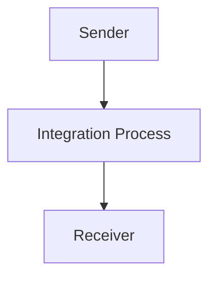

<h1 style="color: #1f4e79; font-size: 3em; text-align: center; margin-top: 5px; margin-bottom: 5px;">Odata Mass PDF upload</h1><h2 style="color: #1f4e79; font-size: 1.5em; text-align: center; margin-top: 5px; margin-bottom: 0px;">SAP CPI Technical Specification Document</h2>

<table border="1" style="width: 400px; border-collapse: collapse; border-color: black; margin: 0 auto; text-align: left;">
  <tr><td style="width: 30%; padding: 5px;">**Author:**</td><td style="padding: 5px;">Rohancherian783</td></tr>
  <tr><td style="padding: 5px;">**Date:**</td><td style="padding: 5px;">2025-12-11</td></tr>
  <tr><td style="padding: 5px;">**Version (Commit):**</td><td style="padding: 5px;">c7b96d0</td></tr>
</table>

<h1 style="color: #1f4e79; font-size: 2.5em;">Table of Contents</h1>

1. Introduction  
    1.1 Purpose  
    1.2 Scope  
2. Integration Overview  
    2.1 Integration Architecture  
    2.2 Integration Components  
3. Integration Scenarios  
    3.1 Scenario Description  
    3.2 Data Flows  
    3.3 Security Requirements  
4. Error Handling and Logging  
5. Testing Validation  
6. Reference Documents  

# 1. Introduction

## 1.1 Purpose
The purpose of the iFlow 'Odata_Mass_PDF_upload' is to facilitate the mass upload of PDF documents through an OData service. This integration flow is designed to streamline the process of handling PDF files, ensuring they are correctly processed and stored in the target system.

## 1.2 Scope
This iFlow is intended for use within the SAP Cloud Platform Integration (CPI) environment. It interacts with various systems that support OData protocols, specifically focusing on the upload of PDF documents. The affected systems include the sender system that initiates the upload and the receiver system that processes the uploaded files.

# 2. Integration Overview

## 2.1 Integration Architecture
The integration architecture for the 'Odata_Mass_PDF_upload' iFlow consists of a sender and a receiver, with an integration process in between. The sender initiates the upload of PDF documents, which are then processed by the integration flow before being sent to the receiver system.

## 2.2 Integration Components
- **Sender System**: This is the system that initiates the PDF upload via an OData service.
- **Receiver System**: This is the target system that receives and processes the uploaded PDF documents.
- **Adapter Types Used**: The integration flow utilizes OData adapters for communication between the sender and receiver systems.

# 3. Integration Scenarios

## 3.1 Scenario Description
The integration scenario begins with the sender system triggering the upload of PDF documents. The integration process handles the incoming request, processes the PDF files, and forwards them to the receiver system for storage or further processing.

## 3.2 Data Flows
The data flow involves the following steps:
1. The sender system sends a request to the iFlow with the PDF document.
2. The integration process receives the document and performs any necessary transformations or validations.
3. The processed document is then sent to the receiver system.

### Mapping Logic Summary
Currently, there are no specific XSLT mappings or transformation logic detailed in the provided artifacts. The integration primarily focuses on the handling of PDF uploads.

### Groovy Script Explanations
No Groovy scripts are included in the provided artifacts for this iFlow. The integration logic appears to be straightforward without additional scripting.

## 3.3 Security Requirements
The iFlow configuration indicates that basic authentication is not enabled for the sender. Security measures should be considered to ensure that the PDF uploads are secure, including potential use of HTTPS and proper authentication mechanisms in the sender and receiver systems.

# 4. Error Handling and Logging
The iFlow is configured with properties that suggest error handling is not explicitly defined. The `returnExceptionToSender` property is set to false, indicating that exceptions may not be returned to the sender. It is advisable to implement logging mechanisms to capture errors during the upload process for troubleshooting.

# 5. Testing Validation
Key testing scenarios for the 'Odata_Mass_PDF_upload' iFlow should include:
- Validating successful uploads of PDF documents.
- Testing the handling of invalid PDF formats or corrupted files.
- Ensuring that the integration flow correctly processes and forwards documents to the receiver system.

# 6. Reference Documents
- **iFlow Content**: `Odata_Mass_PDF_upload.iflw`
- **Integration Artifacts**: No additional Groovy scripts or XSLT files were provided for this iFlow.
