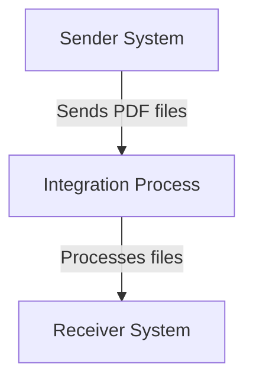

\n\n\n\n\n\n\n<h1 style="color: #1f4e79; font-size: 3em; text-align: left; margin-top: 100px;">AI Tech Specification Project - Odata Mass PDF upload - Odata Mass PDF upload</h1>\n\n\n\n\n\n\n\n\n\n\n\n\n<table border="1" style="width: 400px; border-collapse: collapse; border-color: black;">\n  <tr><td style="width: 30%; padding: 5px;">**Author:**</td><td style="padding: 5px;">Nidhi Srivastava</td></tr>\n  <tr><td style="padding: 5px;">**Date:**</td><td style="padding: 5px;">2025-12-01</td></tr>\n  <tr><td style="padding: 5px;">**Version:**</td><td style="padding: 5px;">Draft</td></tr>\n</table>\n\n\n\n\n\n\n\n\n\n\n\n\n\n\n\n\n\n\n\n\n\n\n\n<h1 style="color: #1f4e79; font-size: 2.5em;">Table of Contents</h1>

1. Introduction  
    1.1 Purpose  
    1.2 Scope  
2. Integration Overview  
    2.1 Integration Architecture  
    2.2 Integration Components  
3. Integration Scenarios  
    3.1 Scenario Description  
    3.2 Data Flows  
    3.3 Security Requirements  
4. Error Handling and Logging  
5. Testing Validation  
6. Reference Documents  

          

# 1. Introduction

## 1.1 Purpose
The purpose of the iFlow 'Odata_Mass_PDF_upload' is to facilitate the mass upload of PDF documents via OData services. This integration flow is designed to streamline the process of transferring multiple PDF files from a sender system to a receiver system, ensuring that the documents are processed efficiently and accurately.

## 1.2 Scope
This iFlow is intended for use within the SAP Cloud Platform Integration (CPI) environment. It interacts with OData services to receive PDF files from a sender system and subsequently uploads them to a designated receiver system. The systems affected by this iFlow include the sender application that generates the PDF files and the receiver application that consumes these files.

# 2. Integration Overview

## 2.1 Integration Architecture
The integration architecture for the 'Odata_Mass_PDF_upload' iFlow consists of a sender and a receiver, with an integration process that manages the flow of data between them. The sender initiates the process by sending PDF files, which are then processed and forwarded to the receiver.

## 2.2 Integration Components
The integration components of this iFlow include:

- **Sender System**: The system that initiates the upload of PDF files.
- **Receiver System**: The system that receives and processes the uploaded PDF files.
- **Adapters Used**: The iFlow utilizes OData adapters for communication between the sender and receiver systems.

# 3. Integration Scenarios

## 3.1 Scenario Description
The integration scenario begins with the sender system generating PDF files. These files are sent to the integration process via an OData service. The integration process handles the incoming files, processes them as necessary, and forwards them to the receiver system for further handling.

## 3.2 Data Flows
The data flow within the iFlow involves the following steps:

1. **Receiving PDF Files**: The integration process listens for incoming PDF files from the sender system.
2. **Processing Logic**: Any necessary transformations or validations are performed on the incoming files.
3. **Forwarding to Receiver**: The processed PDF files are sent to the receiver system for final processing.

### Groovy Script Explanations
Currently, there are no Groovy scripts included in the provided artifacts for this iFlow. If any Groovy scripts were to be included, they would typically be used for custom processing logic or data transformation.

## 3.3 Security Requirements
The security configuration for this iFlow includes:

- **Authentication**: Basic authentication is not enabled for the sender endpoint.
- **Transport Security**: It is recommended to use HTTPS for secure data transmission.
- **Access Control**: The iFlow does not currently implement CORS or credential handling, which may need to be addressed based on organizational security policies.

# 4. Error Handling and Logging
Error handling within the iFlow is managed through the configuration of the integration process. The property `returnExceptionToSender` is set to false, indicating that exceptions will not be returned to the sender. Instead, they will be logged for monitoring and troubleshooting purposes.

# 5. Testing Validation
Key testing scenarios for the 'Odata_Mass_PDF_upload' iFlow include:

- **Successful Upload**: Validate that PDF files are successfully uploaded from the sender to the receiver.
- **Error Handling**: Test the iFlow's response to invalid PDF files or network issues.
- **Performance Testing**: Assess the iFlow's performance when handling large volumes of PDF files.

# 6. Reference Documents
The following artifacts were analyzed for the creation of this documentation:

- iFlow Content: `Odata_Mass_PDF_upload.iflw`
