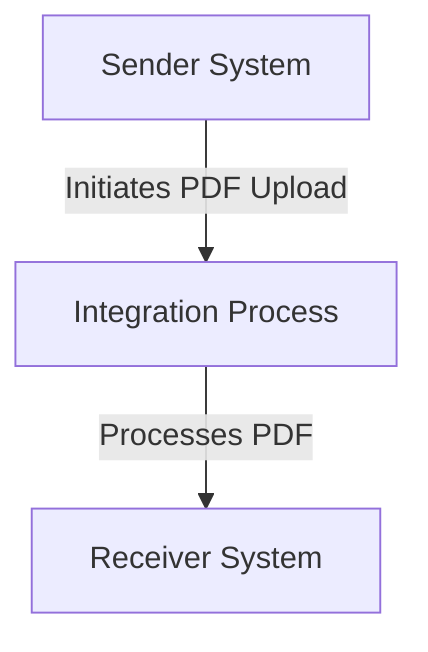

<h1 style="color: #1f4e79; font-size: 3em; text-align: center; margin-top: 5px; margin-bottom: 5px;">Odata Mass PDF upload</h1><h2 style="color: #1f4e79; font-size: 1.5em; text-align: center; margin-top: 5px; margin-bottom: 0px;">SAP CPI Technical Specification Document</h2>

<table border="1" style="width: 400px; border-collapse: collapse; border-color: black; margin: 0 auto; text-align: left;"><tr><td style="width: 30%; padding: 5px;">**Author:**</td><td style="padding: 5px;">Rohancherian783</td></tr><tr><td style="padding: 5px;">**Date:**</td><td style="padding: 5px;">2025-12-11</td></tr><tr><td style="padding: 5px;">**Version (Commit):**</td><td style="padding: 5px;">d95a141</td></tr></table>

<h1 style="color: #1f4e79; font-size: 2.5em;">Table of Contents</h1>

1. Introduction  
   1.1 Purpose  
   1.2 Scope  
2. Integration Overview  
   2.1 Integration Architecture  
   2.2 Integration Components  
3. Integration Scenarios  
   3.1 Scenario Description  
   3.2 Data Flows  
   3.3 Security Requirements  
4. Error Handling and Logging  
5. Testing Validation  
6. Reference Documents  

<h1 style="color: #1f4e79;">1. Introduction</h1>

<h2 style="color: #1f4e79;">1.1 Purpose</h2>  
The purpose of the iFlow 'Odata_Mass_PDF_upload' is to facilitate the mass upload of PDF documents via OData services. This integration flow is designed to streamline the process of handling PDF files, ensuring that they are correctly processed and stored in the target system.

<h2 style="color: #1f4e79;">1.2 Scope</h2>  
This iFlow operates within the SAP Cloud Platform Integration (CPI) environment and interacts with various systems that support OData protocols. The primary systems affected include the sender system that initiates the PDF upload and the receiver system that processes and stores the uploaded documents. The iFlow is designed to handle the integration between these systems, ensuring data consistency and integrity throughout the upload process.

<h1 style="color: #1f4e79;">2. Integration Overview</h1>

<h2 style="color: #1f4e79;">2.1 Integration Architecture</h2>  
The integration architecture for the 'Odata_Mass_PDF_upload' iFlow consists of a sender and a receiver, with a defined integration process that manages the flow of data. The architecture is designed to ensure seamless communication between the systems involved in the PDF upload process.

<h2 style="color: #1f4e79;">2.2 Integration Components</h2>  
The integration components for this iFlow include:
- **Sender System**: This is the system that initiates the PDF upload process.
- **Receiver System**: This is the target system that receives and processes the uploaded PDF documents.
- **Adapters Used**: The iFlow utilizes OData adapters for communication between the sender and receiver systems, ensuring that the data is transmitted in the correct format.

<h1 style="color: #1f4e79;">3. Integration Scenarios</h1>

<h2 style="color: #1f4e79;">3.1 Scenario Description</h2>  
The integration scenario begins with the sender system initiating a request to upload PDF documents. The iFlow captures this request and processes the PDF files accordingly. The flow concludes with the successful transfer of the documents to the receiver system, where they are stored for further use.

<h2 style="color: #1f4e79;">3.2 Data Flows</h2>  
The data flow within the iFlow involves the following steps:
1. The sender system sends a request to upload PDF documents.
2. The integration process captures the request and processes the PDF files.
3. The processed PDF files are sent to the receiver system for storage.

The iFlow may include mapping logic to transform the data format as required by the receiver system. Any necessary Groovy scripts would be utilized to handle specific processing tasks, such as validation or transformation of the PDF data.

<h2 style="color: #1f4e79;">3.3 Security Requirements</h2>  
Security measures for this iFlow include:
- **Authentication**: The iFlow does not enable basic authentication, as indicated by the configuration settings.
- **Data Protection**: The integration flow ensures that sensitive data is handled securely during the upload process, adhering to best practices for data protection and compliance.

<h1 style="color: #1f4e79;">4. Error Handling and Logging</h1>  
Error handling within the iFlow is managed through defined properties that dictate how exceptions are handled. The configuration specifies that exceptions are not returned to the sender, which may require additional logging mechanisms to capture errors for troubleshooting purposes. The integration process should include logging steps to record any issues encountered during the PDF upload process.

<h1 style="color: #1f4e79;">5. Testing Validation</h1>  
Key testing scenarios for the iFlow include:
- Validating the successful upload of PDF documents from the sender system to the receiver system.
- Testing the handling of invalid PDF formats to ensure that errors are captured and logged appropriately.
- Ensuring that the integration flow adheres to performance benchmarks, particularly during mass uploads.

<h1 style="color: #1f4e79;">6. Reference Documents</h1>  
The following artifacts were analyzed for the creation of this report:
- iFlow Content: `Odata_Mass_PDF_upload.iflw`
- Configuration settings and properties defined within the iFlow.

