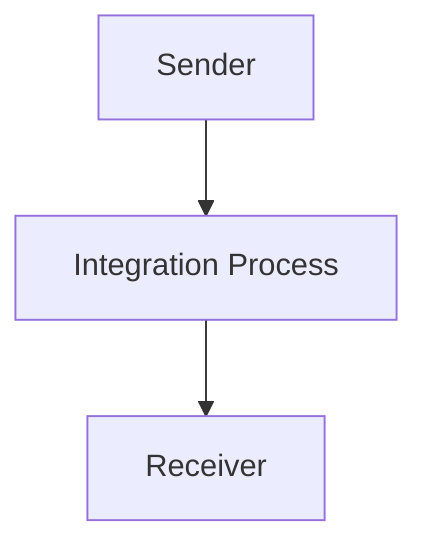

<h1 style="color: #1f4e79; font-size: 3em; text-align: left; margin-top: 100px;">AI Tech Specification Project - Odata Mass PDF upload - Odata Mass PDF upload</h1>

<table border="1" style="width: 400px; border-collapse: collapse; border-color: black;">
  <tr><td style="width: 30%; padding: 5px;">**Author:**</td><td style="padding: 5px;">Nidhi Srivastava</td></tr>
  <tr><td style="padding: 5px;">**Date:**</td><td style="padding: 5px;">2025-12-01</td></tr>
  <tr><td style="padding: 5px;">**Version:**</td><td style="padding: 5px;">Draft</td></tr>
</table>

<h1 style="color: #1f4e79; font-size: 2.5em;">Table of Contents</h1>

1. Introduction  
    1.1 Purpose  
    1.2 Scope  
2. Integration Overview  
    2.1 Integration Architecture  
    2.2 Integration Components  
3. Integration Scenarios  
    3.1 Scenario Description  
    3.2 Data Flows  
    3.3 Security Requirements  
4. Error Handling and Logging  
5. Testing Validation  
6. Reference Documents  

          

# 1. Introduction

## 1.1 Purpose
The purpose of the iFlow 'Odata_Mass_PDF_upload' is to facilitate the mass upload of PDF documents through an OData service. This integration flow is designed to streamline the process of handling PDF files, ensuring that they are correctly processed and stored in the target system.

## 1.2 Scope
This iFlow operates within the SAP Cloud Platform Integration (CPI) environment and interacts with various systems, including the sender and receiver endpoints. The primary focus is on the integration of OData services for PDF uploads, and it does not cover other file types or integration scenarios outside of this specific use case.

# 2. Integration Overview

## 2.1 Integration Architecture
The integration architecture for the 'Odata_Mass_PDF_upload' iFlow consists of a sender and a receiver, with an integration process that manages the flow of data between them. The architecture is designed to ensure efficient handling of PDF uploads via OData.

## 2.2 Integration Components
- **Sender System**: The component responsible for initiating the PDF upload process.
- **Receiver System**: The endpoint where the uploaded PDFs are stored or processed.
- **Adapter Types Used**: The iFlow utilizes OData adapters for communication between the sender and receiver systems.

# 3. Integration Scenarios

## 3.1 Scenario Description
The integration scenario begins with the sender system triggering the upload of PDF documents. The integration process receives the documents, processes them as necessary, and forwards them to the receiver system for storage or further processing.

## 3.2 Data Flows
The data flow involves the following steps:
1. The sender sends a request to the integration process with the PDF data.
2. The integration process handles the incoming data, potentially transforming it if necessary.
3. The processed data is then sent to the receiver system.

### Mapping Logic Summary
Currently, there are no specific XSLT mappings or detailed transformation logic provided in the artifacts. The integration flow primarily focuses on the transfer of PDF files without complex data transformations.

### Groovy Script Explanations
No Groovy scripts are included in the provided artifacts for this iFlow. The integration logic appears to be straightforward, relying on the capabilities of the OData adapter.

## 3.3 Security Requirements
The iFlow configuration indicates that basic authentication is not enabled for the sender. Security measures should be considered based on the specific requirements of the sender and receiver systems, including the use of secure connections (HTTPS) and proper handling of credentials.

# 4. Error Handling and Logging
The iFlow is configured with properties that suggest error handling is not explicitly defined. The `returnExceptionToSender` property is set to false, indicating that exceptions may not be returned to the sender. It is advisable to implement logging mechanisms to capture errors and facilitate troubleshooting.

# 5. Testing Validation
Key testing scenarios for this iFlow should include:
- Validating the successful upload of PDF documents from the sender to the receiver.
- Testing the handling of invalid PDF formats or corrupted files.
- Ensuring that the integration process correctly logs any errors encountered during the upload.

# 6. Reference Documents
- iFlow Content: `Odata_Mass_PDF_upload.iflw`
