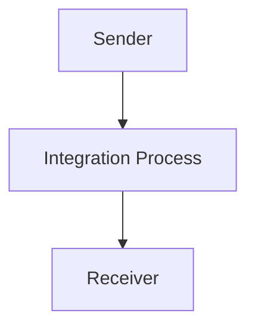

<div style="float: left; text-align: left;"></div><div style="float: right; text-align: right;"></div><div style="clear: both;"></div><div style="height: 80px;"></div><h1 style="color: #1f4e79; font-size: 3em; text-align: center; margin-top: 5px; margin-bottom: 5px;">Odata Mass PDF upload</h1><h2 style="color: #1f4e79; font-size: 1.5em; text-align: center; margin-top: 5px; margin-bottom: 0px;">SAP CPI Technical Specification Document</h2><div style="height: 100px;"></div><div style="width: 100%; text-align: center;">
<table border="1" style="width: 400px; border-collapse: collapse; border-color: black; margin: 0 auto; text-align: left;">
  <tr><td style="width: 30%; padding: 5px;">**Author:**</td><td style="padding: 5px;">Rohancherian783</td></tr>
  <tr><td style="padding: 5px;">**Date:**</td><td style="padding: 5px;">2025-12-11</td></tr>
  <tr><td style="padding: 5px;">**Version (Commit):**</td><td style="padding: 5px;">c95f5ee</td></tr>
</table>
</div>

<div style="page-break-after: always;"></div>

```markdown

<h1 style="color: #1f4e79; font-size: 2.5em;">Table of Contents</h1>

1. Introduction  
    1.1 Purpose  
    1.2 Scope  
2. Integration Overview  
    2.1 Integration Architecture  
    2.2 Integration Components  
3. Integration Scenarios  
    3.1 Scenario Description  
    3.2 Data Flows  
    3.3 Security Requirements  
4. Error Handling and Logging  
5. Testing Validation  
6. Reference Documents  


<div style="page-break-after: always;"></div>


<h1 style="color: #1f4e79;">1. Introduction</h1>

<h2 style="color: #1f4e79;">1.1 Purpose</h2>  
The purpose of the iFlow 'Odata_Mass_PDF_upload' is to facilitate the mass upload of PDF documents via OData services. This integration flow is designed to streamline the process of handling multiple PDF files, ensuring they are correctly processed and uploaded to the target system.

<h2 style="color: #1f4e79;">1.2 Scope</h2>  
This iFlow operates within the SAP Cloud Platform Integration (CPI) environment and interacts with both sender and receiver systems. The primary systems affected include the source system that generates the PDF files and the target system where these files are uploaded. The iFlow is responsible for managing the data transfer and ensuring data integrity during the upload process.

<h1 style="color: #1f4e79;">2. Integration Overview</h1>

<h2 style="color: #1f4e79;">2.1 Integration Architecture</h2>  
The integration architecture for the 'Odata_Mass_PDF_upload' iFlow consists of a sender and a receiver, with an integration process that manages the flow of data. The architecture is designed to handle the initiation of the upload process, the processing of the PDF files, and the completion of the upload.



<h2 style="color: #1f4e79;">2.2 Integration Components</h2>  
The integration components include:
- **Sender**: This component initiates the upload process by sending the PDF files.
- **Receiver**: This component receives the uploaded PDF files.
- **Adapters**: The iFlow utilizes HTTP adapters for communication between the sender and receiver systems.

<h1 style="color: #1f4e79;">3. Integration Scenarios</h1>

<h2 style="color: #1f4e79;">3.1 Scenario Description</h2>  
The integration scenario begins with the sender system generating PDF files. The iFlow is triggered to process these files, which are then uploaded to the receiver system. The flow consists of a start event that initiates the process and an end event that signifies the completion of the upload.

<h2 style="color: #1f4e79;">3.2 Data Flows</h2>  
The data flow involves the transfer of PDF files from the sender to the receiver. The iFlow does not specify any complex mapping logic or transformations, as the primary function is to facilitate the upload of files directly.

<h2 style="color: #1f4e79;">3.3 Security Requirements</h2>  
The iFlow configuration indicates that basic authentication is not enabled for the sender. Security measures should be implemented to ensure that the data transfer is secure, including the use of HTTPS for communication and proper handling of credentials if required.

<h1 style="color: #1f4e79;">4. Error Handling and Logging</h1>  
Error handling mechanisms are not explicitly defined in the provided iFlow configuration. However, it is essential to implement logging to capture any errors that occur during the upload process. This can include logging the start and end of the process, as well as any exceptions that may arise.

<h1 style="color: #1f4e79;">5. Testing Validation</h1>  
Key testing scenarios for the iFlow include:
- Validating the successful upload of PDF files from the sender to the receiver.
- Testing the handling of invalid or corrupted PDF files.
- Ensuring that the integration process completes without errors and that logs are generated correctly.

<h1 style="color: #1f4e79;">6. Reference Documents</h1>  
The following artifacts were analyzed for this report:
- iFlow Content: `Odata_Mass_PDF_upload.iflw`
- Integration architecture and process definitions.
```
