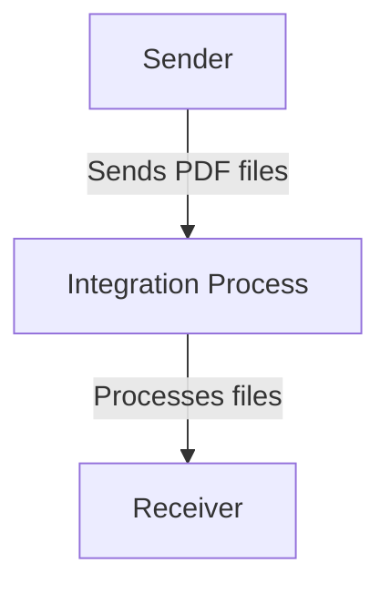

<h1 style="color: #1f4e79; font-size: 3em; text-align: center; margin-top: 5px; margin-bottom: 5px;">Odata Mass PDF upload</h1><h2 style="color: #1f4e79; font-size: 1.5em; text-align: center; margin-top: 5px; margin-bottom: 0px;">SAP CPI Technical Specification Document</h2>

<table border="1" style="width: 400px; border-collapse: collapse; border-color: black; margin: 0 auto; text-align: left;"><tr><td style="width: 30%; padding: 5px;">**Author:**</td><td style="padding: 5px;">Rohancherian783</td></tr><tr><td style="padding: 5px;">**Date:**</td><td style="padding: 5px;">2025-12-11</td></tr><tr><td style="padding: 5px;">**Version (Commit):**</td><td style="padding: 5px;">a7337ea</td></tr></table>

<h1 style="color: #1f4e79; font-size: 2.5em;">Table of Contents</h1>

1. Introduction  
   1.1 Purpose  
   1.2 Scope  
2. Integration Overview  
   2.1 Integration Architecture  
   2.2 Integration Components  
3. Integration Scenarios  
   3.1 Scenario Description  
   3.2 Data Flows  
   3.3 Security Requirements  
4. Error Handling and Logging  
5. Testing Validation  
6. Reference Documents  

<h1 style="color: #1f4e79;">1. Introduction</h1>

<h2 style="color: #1f4e79;">1.1 Purpose</h2>  
The purpose of the iFlow 'Odata_Mass_PDF_upload' is to facilitate the mass upload of PDF documents through an OData service. This integration flow is designed to streamline the process of handling multiple PDF files, ensuring they are correctly processed and uploaded to the target system.

<h2 style="color: #1f4e79;">1.2 Scope</h2>  
This iFlow operates within the SAP Cloud Platform Integration (CPI) environment and interacts with both sender and receiver systems. The primary systems affected include the source system that generates the PDF files and the target system where these files are uploaded. The iFlow handles the orchestration of data transfer and ensures that the files are uploaded efficiently.

<h1 style="color: #1f4e79;">2. Integration Overview</h1>

<h2 style="color: #1f4e79;">2.1 Integration Architecture</h2>  
The integration architecture for the 'Odata_Mass_PDF_upload' iFlow consists of a sender and a receiver, with a defined process flow that manages the upload of PDF documents. The architecture is designed to ensure seamless communication between the systems involved.

<h2 style="color: #1f4e79;">2.2 Integration Components</h2>  
The integration components include:
- **Sender**: This is the endpoint that initiates the process by sending PDF files to the integration flow.
- **Receiver**: This endpoint receives the processed PDF files.
- **Adapters**: The iFlow utilizes HTTP adapters for both sending and receiving data.

<h1 style="color: #1f4e79;">3. Integration Scenarios</h1>

<h2 style="color: #1f4e79;">3.1 Scenario Description</h2>  
The integration scenario begins with the sender system triggering the iFlow by sending a request containing the PDF files. The integration process then handles the incoming files, processes them as necessary, and forwards them to the receiver system for storage or further processing.

<h2 style="color: #1f4e79;">3.2 Data Flows</h2>  
The data flow involves the following steps:
1. The sender sends a request to the iFlow with the PDF files.
2. The integration process receives the files and may perform validation or transformation if required.
3. The processed files are then sent to the receiver system.

The iFlow may include Groovy scripts for additional processing logic, such as validating file formats or handling errors during the upload process.

<h2 style="color: #1f4e79;">3.3 Security Requirements</h2>  
Security measures for this iFlow include:
- **Authentication**: Basic authentication is not enabled for the sender, but it can be configured if required.
- **Data Protection**: The iFlow ensures that sensitive data is handled securely during transmission.
- **Access Control**: Proper access control mechanisms should be in place to restrict unauthorized access to the PDF files.

<h1 style="color: #1f4e79;">4. Error Handling and Logging</h1>  
Error handling within the iFlow is managed through defined properties such as `returnExceptionToSender`, which is set to false, indicating that exceptions will not be returned to the sender. Instead, errors will be logged for monitoring and troubleshooting purposes. The integration process should include mechanisms to capture and log errors effectively.

<h1 style="color: #1f4e79;">5. Testing Validation</h1>  
Key testing scenarios for the iFlow include:
- Validating the successful upload of PDF files from the sender to the receiver.
- Testing the handling of invalid file formats or corrupted files.
- Ensuring that error logging works as expected when exceptions occur.

<h1 style="color: #1f4e79;">6. Reference Documents</h1>  
The following artifacts were analyzed for this report:
- iFlow Content: `Odata_Mass_PDF_upload.iflw`  
- Integration architecture and process definitions.

