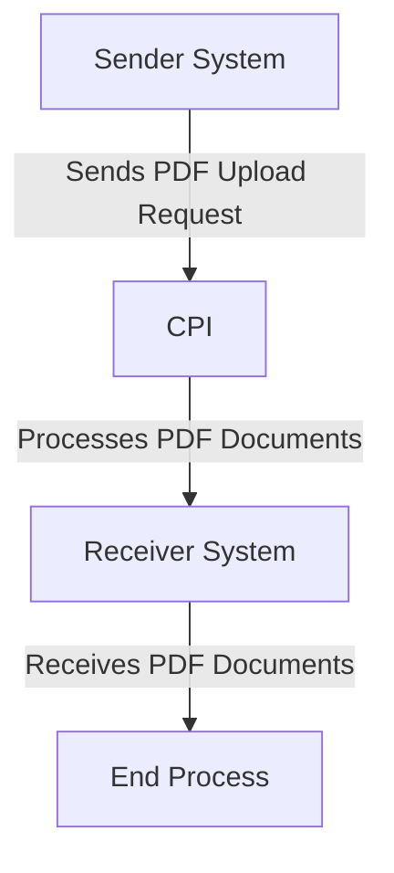

# Odata_Mass_PDF_upload iFlow Documentation

## 1. High-level architecture
The Odata_Mass_PDF_upload iFlow is designed to facilitate the integration between a sender system and a receiver system, enabling the upload of PDF documents through an OData service. The architecture consists of a sender endpoint that initiates the process, a central integration process within SAP Cloud Platform Integration (CPI), and a receiver endpoint that processes the uploaded PDF files.

## 2. Purpose of this iFlow
The primary purpose of the Odata_Mass_PDF_upload iFlow is to handle the mass upload of PDF documents from a sender system to a receiver system using OData protocols. This integration ensures that documents are transferred efficiently and reliably, allowing for further processing or storage in the receiver system.

## 3. Sender/Receiver systems
- **Sender System**: The system that initiates the PDF upload process. It sends the PDF documents to the CPI.
- **Receiver System**: The system that receives the uploaded PDF documents from the CPI for further processing or storage.

## 4. Adapter types used
The iFlow utilizes the following adapter types:
- **HTTP Adapter**: Used for the sender endpoint to receive requests from the sender system.
- **OData Adapter**: Facilitates the communication between the sender and receiver systems using OData protocols.

## 5. Step-by-step flow explanation
1. **Start Event**: The process begins with a start event that triggers the iFlow when a request is received from the sender system.
2. **Integration Process**: The integration process handles the incoming request, processes the PDF documents, and prepares them for transmission to the receiver system.
3. **End Event**: The process concludes with an end event, indicating that the PDF upload has been completed successfully.

## 6. Mapping logic summary
The iFlow does not explicitly include XSLT or mapping logic in the provided artifacts. However, it is implied that any necessary transformations or mappings would occur within the integration process to ensure that the PDF documents are formatted correctly for the receiver system.

## 7. Groovy script explanations
No Groovy scripts are provided in the artifacts for the Odata_Mass_PDF_upload iFlow. If any Groovy scripts were to be included, they would typically be used for custom logic, data transformation, or error handling within the integration process.

## 8. Error handling
The iFlow is configured to handle errors gracefully. The property `returnExceptionToSender` is set to `false`, indicating that exceptions will not be returned to the sender system. Instead, errors will be logged and managed within the CPI environment, allowing for monitoring and troubleshooting without impacting the sender.

## 9. Security/authentication
The iFlow does not enable basic authentication for the sender endpoint, as indicated by the property `enableBasicAuthentication` being set to `false`. This means that the integration does not require credentials for access. However, it is essential to ensure that the communication between the sender and receiver systems is secured through other means, such as network security protocols (e.g., HTTPS).

## 10. High-Level Process Flow Diagram

