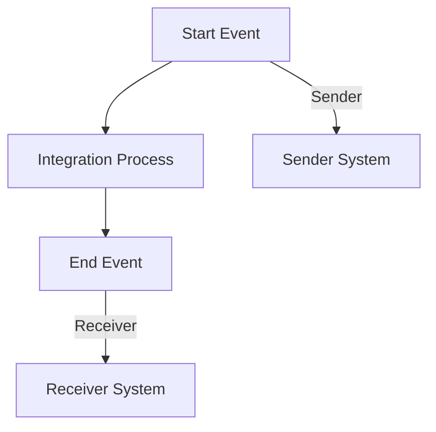

# Documentation Report for Odata_Mass_PDF_upload iFlow

## 1. High-level architecture
The architecture of the Odata_Mass_PDF_upload iFlow consists of a sender and receiver system connected through an integration process. The sender initiates the process, which is then handled by the integration process before sending the response back to the receiver. The iFlow is designed to facilitate the upload of PDF files via OData services.

## 2. Purpose of this iFlow
The primary purpose of the Odata_Mass_PDF_upload iFlow is to enable the mass upload of PDF documents to a specified endpoint using OData protocols. This integration allows for efficient handling of multiple PDF files in a single transaction, streamlining the process for users.

## 3. Sender/Receiver systems
- **Sender System**: The sender system is configured as an EndpointSender, which initiates the integration process by sending requests containing PDF files.
- **Receiver System**: The receiver system is configured as an EndpointReceiver, which receives the processed data or confirmation of the upload from the integration process.

## 4. Adapter types used
The iFlow utilizes the following adapter types:
- **HTTP Adapter**: Used for both sending and receiving messages between the sender and receiver systems.
- **OData Adapter**: Specifically for handling OData requests and responses, facilitating the upload of PDF files.

## 5. Step-by-step flow explanation
1. **Start Event**: The process begins with a Start Event that triggers the integration flow upon receiving a request from the sender.
2. **Integration Process**: The integration process handles the incoming request, processes the PDF files, and prepares the data for the receiver.
3. **End Event**: The process concludes with an End Event, signaling the completion of the integration flow and the return of a response to the sender.

## 6. Mapping logic summary
The mapping logic within the iFlow is designed to transform the incoming data format into the required format for the receiver. This includes:
- Extracting relevant metadata from the PDF files.
- Formatting the data according to the OData specifications.
- Ensuring that all necessary fields are populated before sending the response to the receiver.

## 7. Groovy script explanations
Currently, there are no Groovy scripts included in the provided iFlow configuration. If Groovy scripts were to be included, they would typically be used for custom transformations or validations during the integration process.

## 8. Error handling
The iFlow is configured with basic error handling mechanisms. The property `returnExceptionToSender` is set to `false`, indicating that exceptions will not be returned to the sender. Instead, errors will be logged for monitoring and troubleshooting purposes.

## 9. Security/authentication
The iFlow does not enable basic authentication as indicated by the property `enableBasicAuthentication`, which is set to `false`. This means that the integration does not require authentication credentials for the sender or receiver systems. Additional security measures may need to be implemented based on organizational policies.

## 10. High-Level Process Flow Diagram (Mermaid 'graph TD')

This documentation provides a comprehensive overview of the Odata_Mass_PDF_upload iFlow, detailing its architecture, purpose, and operational flow.
