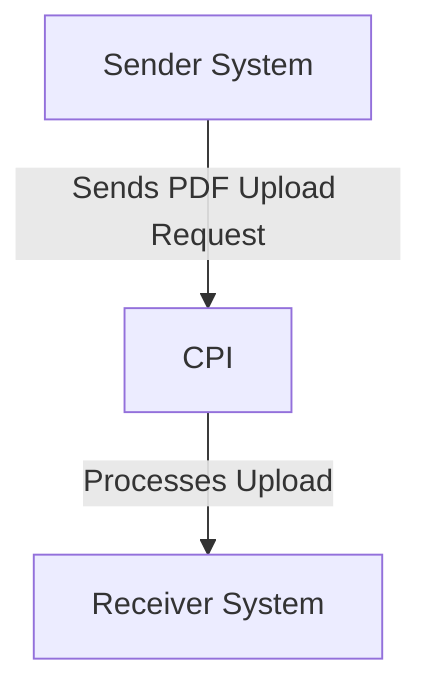

# Odata_Mass_PDF_upload iFlow Documentation

## 1. High-level architecture
The Odata_Mass_PDF_upload iFlow is designed to facilitate the integration between a sender system and a receiver system, enabling the mass upload of PDF documents via OData services. The architecture consists of a sender endpoint that triggers the process, an integration process that handles the business logic, and a receiver endpoint that processes the uploaded documents.

## 2. Purpose of this iFlow
The primary purpose of the Odata_Mass_PDF_upload iFlow is to automate the process of uploading multiple PDF files from a sender system to a receiver system using OData protocols. This integration ensures that the documents are transferred efficiently and reliably, reducing manual intervention and potential errors.

## 3. Sender/Receiver systems
- **Sender System**: The system that initiates the upload of PDF documents. It sends the data to the CPI (Cloud Platform Integration).
- **Receiver System**: The system that receives the uploaded PDF documents for processing and storage.

## 4. Adapter types used
The iFlow utilizes the following adapter types:
- **HTTP Adapter**: Used for sending and receiving HTTP requests between the sender and receiver systems.
- **OData Adapter**: Specifically used to handle OData requests for document uploads.

## 5. Step-by-step flow explanation
1. **Start Event**: The process begins with a start event that triggers the integration flow upon receiving a request from the sender system.
2. **Integration Process**: The main logic of the iFlow is executed, which includes handling the incoming data and preparing it for upload.
3. **End Event**: The process concludes with an end event, signaling the completion of the document upload.

## 6. Mapping logic summary
The iFlow may include XSLT or other mapping configurations to transform the incoming data format into the required format for the receiver system. However, specific mapping logic details are not provided in the artifact.

## 7. Groovy script explanations
No Groovy scripts are explicitly mentioned in the provided artifact. If any Groovy scripts were part of the iFlow, they would typically be used for data transformation, validation, or custom logic execution during the integration process.

## 8. Error handling
The iFlow is configured to handle errors gracefully. The property `returnExceptionToSender` is set to false, indicating that exceptions will not be returned to the sender system. Instead, errors will be logged and managed within the integration process.

## 9. Security/authentication
The iFlow does not enable basic authentication, as indicated by the property `enableBasicAuthentication` set to false. This suggests that the integration may rely on other security mechanisms, such as OAuth or API keys, for securing the communication between the sender and receiver systems. However, specific credentials and configurations are not detailed in the provided artifact.

## 10. High-Level Process Flow Diagram

