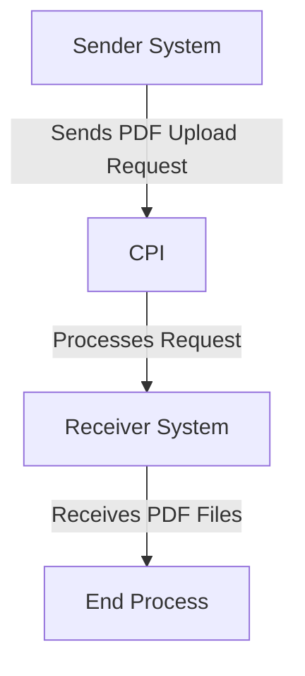

# Odata_Mass_PDF_upload iFlow Documentation

## 1. High-level architecture
The Odata_Mass_PDF_upload iFlow is designed to facilitate the integration between a sender system and a receiver system, enabling the mass upload of PDF files via OData services. The architecture consists of a sender endpoint that triggers the process, an integration process that handles the logic, and a receiver endpoint that processes the uploaded files.

## 2. Purpose of this iFlow
The primary purpose of the Odata_Mass_PDF_upload iFlow is to enable the seamless transfer of PDF documents from a sender system to a receiver system using OData protocols. This integration ensures that large volumes of PDF files can be uploaded efficiently and reliably.

## 3. Sender/Receiver systems
- **Sender System**: The system that initiates the upload of PDF files. It sends requests to the iFlow.
- **Receiver System**: The system that receives the uploaded PDF files for further processing or storage.

## 4. Adapter types used
The iFlow utilizes the following adapter types:
- **HTTP Adapter**: Used for the sender endpoint to receive incoming requests.
- **OData Adapter**: Facilitates the communication between the sender and receiver systems, allowing for the handling of OData requests.

## 5. Step-by-step flow explanation
1. **Start Event**: The process begins when a request is received at the sender endpoint.
2. **Integration Process**: The iFlow processes the incoming request, which may involve transformations or validations.
3. **End Event**: The process concludes after the integration logic has been executed, and the response is sent back to the sender system.

## 6. Mapping logic summary
The iFlow does not explicitly define any XSLT or mapping logic in the provided artifacts. The integration process primarily focuses on the transfer of data without additional transformations.

## 7. Groovy script explanations
No Groovy scripts are included in the provided artifacts for the Odata_Mass_PDF_upload iFlow. The integration logic appears to be straightforward without the need for custom scripting.

## 8. Error handling
The iFlow is configured to handle errors through the default error handling mechanisms provided by SAP CPI. The property `returnExceptionToSender` is set to `false`, indicating that exceptions will not be returned to the sender system directly. Instead, errors will be logged and handled internally.

## 9. Security/authentication
The iFlow does not enable basic authentication for the sender endpoint, as indicated by the property `enableBasicAuthentication` set to `false`. This means that the integration does not require credentials for access. However, it is essential to ensure that the network and transport layers are secured to protect data in transit.

## 10. High-Level Process Flow Diagram

