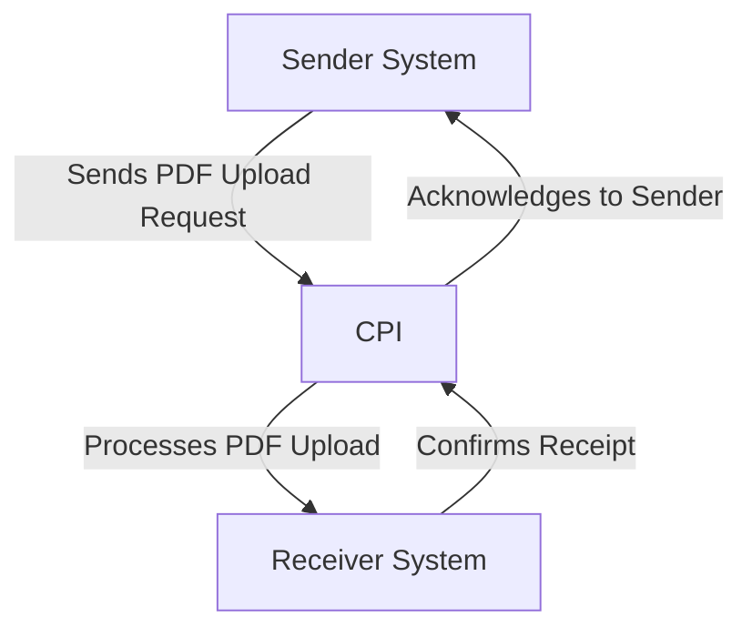

# Odata_Mass_PDF_upload iFlow Documentation

## 1. High-level architecture
The Odata_Mass_PDF_upload iFlow is designed to facilitate the integration between a sender system and a receiver system, enabling the mass upload of PDF documents via OData services. The architecture consists of a sender endpoint that initiates the process, an integration process that handles the logic, and a receiver endpoint that processes the uploaded PDFs.

## 2. Purpose of this iFlow
The primary purpose of the Odata_Mass_PDF_upload iFlow is to enable the seamless transfer of PDF files from a sender system to a receiver system using OData protocols. This integration supports bulk operations, allowing multiple PDF documents to be uploaded efficiently.

## 3. Sender/Receiver systems
- **Sender System**: The system that initiates the upload of PDF documents. It sends requests to the CPI (Cloud Platform Integration) for processing.
- **Receiver System**: The system that receives the uploaded PDF documents from the CPI. It processes and stores the documents as required.

## 4. Adapter types used
The iFlow utilizes the following adapter types:
- **HTTP Adapter**: Used for sending and receiving HTTP requests between the sender and receiver systems.
- **OData Adapter**: Specifically used to handle OData requests and responses, facilitating the interaction with OData services.

## 5. Step-by-step flow explanation
1. **Start Event**: The process begins with a start event that triggers the iFlow upon receiving a request from the sender system.
2. **Integration Process**: The integration process handles the logic for processing the incoming PDF documents.
3. **End Event**: The process concludes with an end event, signaling the completion of the document upload.

## 6. Mapping logic summary
The iFlow does not explicitly include XSLT or mapping logic in the provided artifacts. The integration process primarily focuses on the transfer of PDF documents without additional transformation or mapping requirements.

## 7. Groovy script explanations
No Groovy scripts are provided in the artifacts for the Odata_Mass_PDF_upload iFlow. The integration logic appears to be straightforward, relying on the built-in capabilities of the iFlow without the need for custom scripting.

## 8. Error handling
The iFlow is configured to handle errors through the default error handling mechanisms provided by SAP CPI. The property `returnExceptionToSender` is set to `false`, indicating that exceptions will not be returned to the sender system directly. Instead, errors will be logged and can be monitored through the CPI monitoring tools.

## 9. Security/authentication
The iFlow does not enable basic authentication, as indicated by the property `enableBasicAuthentication` being set to `false`. This means that the integration does not require credentials for accessing the endpoints. However, it is essential to ensure that the sender and receiver systems are secured through other means, such as network security protocols and firewalls.

## 10. High-Level Process Flow Diagram

