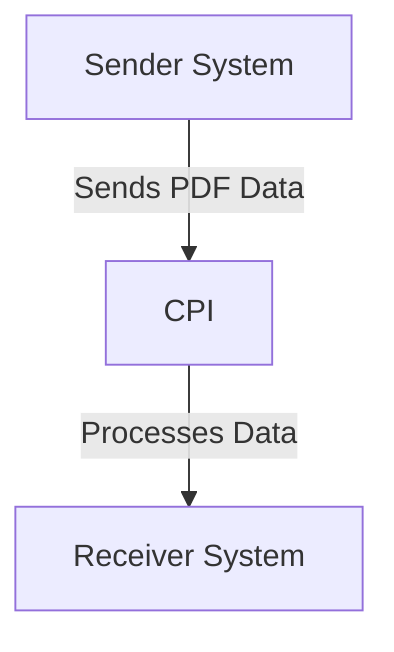

# Odata_Mass_PDF_upload iFlow Documentation

## 1. High-level architecture
The Odata_Mass_PDF_upload iFlow is designed to facilitate the integration between a sender system and a receiver system, enabling the mass upload of PDF documents via OData services. The architecture consists of a sender endpoint that triggers the integration process, which processes the incoming data and forwards it to the designated receiver endpoint.

## 2. Purpose of this iFlow
The primary purpose of the Odata_Mass_PDF_upload iFlow is to handle the mass upload of PDF files from a sender system to a receiver system using OData protocols. This integration ensures that large volumes of PDF documents can be efficiently processed and transferred, maintaining data integrity and consistency throughout the process.

## 3. Sender/Receiver systems
- **Sender System**: The system that initiates the upload of PDF documents. It sends the data to the CPI (Cloud Platform Integration) for processing.
- **Receiver System**: The system that receives the processed PDF documents from the CPI. This system is responsible for storing or further processing the uploaded files.

## 4. Adapter types used
The iFlow utilizes the following adapter types:
- **OData Adapter**: Used for receiving requests from the sender system and sending responses back to the receiver system.
- **HTTP Adapter**: Facilitates communication between the CPI and the external systems, ensuring that data is transmitted over HTTP protocols.

## 5. Step-by-step flow explanation
1. **Start Event**: The integration process begins with a start event that triggers when the sender system sends a request.
2. **Processing**: The iFlow processes the incoming data, which may include validation and transformation steps.
3. **End Event**: The process concludes with an end event, indicating that the data has been successfully processed and sent to the receiver system.

## 6. Mapping logic summary
The iFlow may include mapping logic to transform the incoming data format into the required format for the receiver system. This could involve:
- **XSLT Transformations**: If applicable, XSLT scripts would be used to convert XML data structures.
- **Data Mappings**: Mapping configurations that define how fields from the sender system correspond to fields in the receiver system.

## 7. Groovy script explanations
While no specific Groovy scripts are provided in the artifacts, Groovy scripts in similar iFlows typically serve the following purposes:
- **Data Manipulation**: Scripts may be used to manipulate incoming data, such as extracting specific fields or formatting data.
- **Conditional Logic**: Groovy scripts can implement conditional logic to determine the flow of data based on certain criteria.

## 8. Error handling
The iFlow is configured to handle errors gracefully. Key error handling strategies include:
- **Return Exception to Sender**: The configuration indicates that exceptions are not returned to the sender, which may require additional logging or notification mechanisms.
- **Error Strategy**: The iFlow may implement specific error handling strategies to manage exceptions that occur during processing.

## 9. Security/authentication
The iFlow includes several security configurations:
- **Basic Authentication**: The sender endpoint does not require basic authentication, as indicated by the configuration.
- **CORS and Credentials**: Cross-Origin Resource Sharing (CORS) is disabled, and credentials are not allowed in requests, enhancing security by limiting access.

## 10. High-Level Process Flow Diagram

