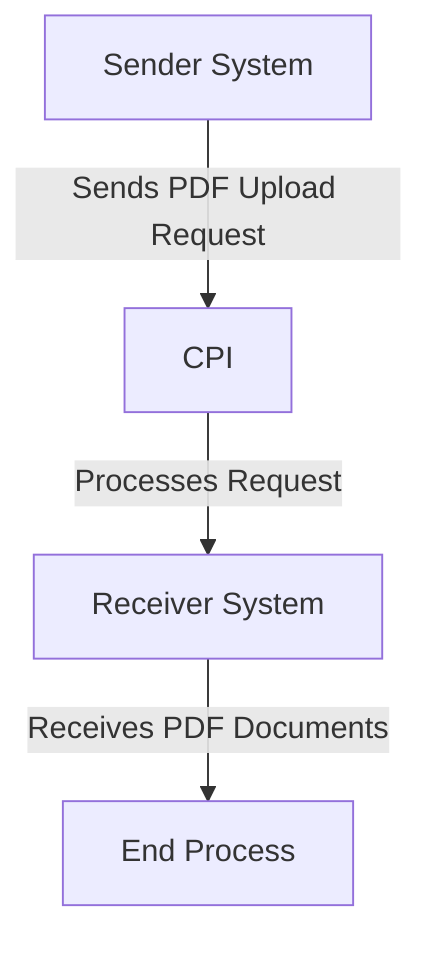

# Odata_Mass_PDF_upload iFlow Documentation

## 1. High-level architecture
The Odata_Mass_PDF_upload iFlow is designed to facilitate the integration between a sender system and a receiver system, enabling the mass upload of PDF documents via OData services. The architecture consists of a sender endpoint that triggers the process, an integration process that handles the data transformation and routing, and a receiver endpoint that finalizes the upload.

## 2. Purpose of this iFlow
The primary purpose of the Odata_Mass_PDF_upload iFlow is to automate the process of uploading multiple PDF documents from a sender system to a receiver system using OData protocols. This integration ensures efficient data handling and minimizes manual intervention.

## 3. Sender/Receiver systems
- **Sender System**: The system that initiates the upload of PDF documents. It sends the data to the CPI (Cloud Platform Integration).
- **Receiver System**: The system that receives the uploaded PDF documents and processes them accordingly.

## 4. Adapter types used
The iFlow utilizes the following adapter types:
- **HTTP Adapter**: Used for the sender to send requests to the CPI.
- **OData Adapter**: Used for the receiver to handle OData requests for PDF uploads.

## 5. Step-by-step flow explanation
1. **Start Event**: The process begins with a start event that triggers the integration flow upon receiving a request from the sender system.
2. **Integration Process**: The integration process handles the incoming data, performing necessary transformations and routing to the appropriate receiver.
3. **End Event**: The process concludes with an end event, indicating the completion of the integration flow.

## 6. Mapping logic summary
The iFlow does not explicitly include XSLT or mapping logic in the provided artifacts. However, it is implied that the integration process may involve data transformation to ensure compatibility between the sender and receiver systems.

## 7. Groovy script explanations
No Groovy scripts are provided in the artifacts for this iFlow. The integration process appears to be straightforward without the need for custom scripting.

## 8. Error handling
The iFlow configuration indicates that the error handling strategy is not explicitly defined. However, it is essential to implement error handling mechanisms to manage exceptions that may arise during the integration process, such as logging errors and sending notifications.

## 9. Security/authentication
The iFlow configuration specifies that basic authentication is not enabled for the sender endpoint. This means that the integration does not require credentials for access. However, it is advisable to implement security measures such as:
- **Transport Layer Security (TLS)**: To encrypt data in transit.
- **Access Control**: To restrict access to authorized users only.

## 10. High-Level Process Flow Diagram

