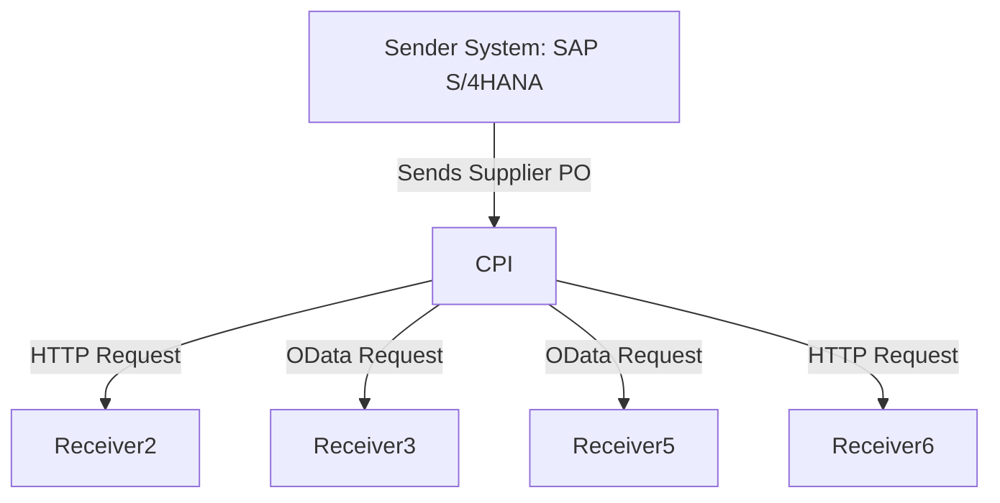

# Technical Documentation for iFlow: delaware.ap.if_mass_upload_of_Supplier_PO_from_S4_copy_2

## 1. High-level architecture
The iFlow integrates multiple systems, facilitating the upload of Supplier Purchase Orders (POs) from an SAP S/4HANA system to various receivers. It employs a combination of HTTP and OData protocols to communicate with sender and receiver systems, ensuring seamless data exchange.

## 2. Purpose of this iFlow
The primary purpose of this iFlow is to automate the mass upload of Supplier Purchase Orders from SAP S/4HANA to designated receiver systems. It processes incoming data, enriches it, and forwards it to multiple endpoints while handling attachments and notifications.

## 3. Sender/Receiver systems
- **Sender System**: SAP S/4HANA
- **Receiver Systems**:
  - Receiver2 (HTTP)
  - Receiver3 (OData)
  - Receiver5 (OData)
  - Receiver6 (HTTP)

## 4. Adapter types used
- **HTTP Adapter**: Used for sending requests to Receiver2 and Receiver6.
- **OData Adapter**: Utilized for communication with Receiver3 and Receiver5, allowing for structured data exchange.

## 5. Step-by-step flow explanation
1. **Start Event**: Triggered by a timer event to initiate the process.
2. **Service Tasks**: Multiple service tasks are executed to handle requests and responses from the sender system and various receivers.
3. **Content Modifiers**: Enrich the message with necessary properties and headers.
4. **Groovy Scripts**: Execute custom logic to manipulate message properties and prepare data for further processing.
5. **Exclusive Gateway**: Routes the flow based on conditions evaluated from message headers.
6. **End Events**: Conclude the process after successfully sending data to all receivers.

## 6. Mapping logic summary
The iFlow utilizes various content modifiers and Groovy scripts to map and transform data:
- **Content Modifiers**: Used to set properties like `LinkedSAPObjectKey`, `BusinessObjectTypeName`, and other relevant fields based on incoming data.
- **Groovy Scripts**:
  - **script1.groovy**: Combines `SupplierInvoice` and `FiscalYear` to create `LinkedSAPObjectKey`.
  - **script2.groovy**: Constructs `LinkedSAPObjectKey` using `PurchaseOrder` and `PurchaseOrderItem`.
  - **script3.groovy**: Prepares an email payload with a PDF attachment for notification purposes.

## 7. Groovy script explanations
- **script1.groovy**: 
  - Purpose: To create a `LinkedSAPObjectKey` by concatenating `SupplierInvoice` and `FiscalYear`.
  - Usage: This key is used for identifying the related SAP object in subsequent processing.

- **script2.groovy**: 
  - Purpose: To build a `LinkedSAPObjectKey` using `PurchaseOrder` and `PurchaseOrderItem`.
  - Usage: This key is stored as a property for OData adapter usage and for debugging.

- **script3.groovy**: 
  - Purpose: To prepare an email payload with a PDF attachment.
  - Usage: Sends notifications with the attached PDF to specified recipients.

## 8. Error handling
The iFlow incorporates error handling mechanisms to manage failures during processing. It includes:
- Logging of errors for monitoring and troubleshooting.
- Conditional routing to handle different error scenarios, ensuring that the process can gracefully handle exceptions and notify relevant stakeholders.

## 9. Security/authentication
- **Authentication Method**: 
  - Basic Authentication is used for HTTP connections to Receiver2 and Receiver5.
  - OAuth2 Client Credentials are used for HTTP connections to Receiver6.
- **Credential Management**: Credentials are securely stored and referenced in the iFlow configuration, ensuring that sensitive information is not hard-coded.

## 10. High-Level Process Flow Diagram

