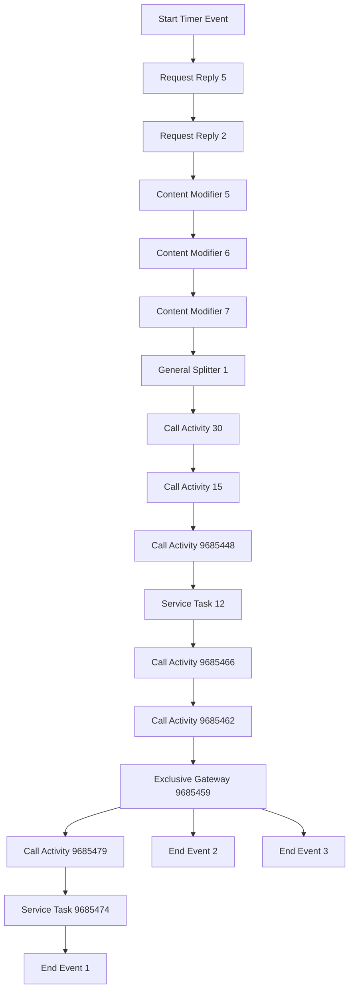

# Technical Documentation for iFlow: delaware.ap.if_mass_upload_of_Supplier_PO_from_S4_copy_2

## 1. High-level architecture
The iFlow integrates SAP S/4HANA with external systems to facilitate the mass upload of Supplier Purchase Orders (POs). It utilizes various adapters to communicate with different endpoints, ensuring seamless data transfer and processing.

## 2. Purpose of this iFlow
The primary purpose of this iFlow is to automate the process of uploading Supplier Purchase Orders from SAP S/4HANA to external systems. This includes fetching relevant data, transforming it as necessary, and sending it to designated endpoints.

## 3. Sender/Receiver systems
- **Sender System**: SAP S/4HANA
- **Receiver Systems**:
  - Receiver2: External system for processing Supplier Invoice data.
  - Receiver3: External system for handling attachment content.
  - Receiver5: External system for Supplier Invoice processing.
  - Receiver6: External system for sending emails.

## 4. Adapter types used
- **HTTP Adapter**: Used for sending and receiving data via HTTP requests.
- **OData Adapter**: Utilized for querying and manipulating data in SAP S/4HANA using OData services.

## 5. Step-by-step flow explanation
1. **Start Event**: Triggered by a timer event to initiate the process.
2. **Service Task (Request Reply 5)**: Fetches Supplier Invoice data from SAP S/4HANA using OData.
3. **Service Task (Request Reply 2)**: Retrieves attachment content related to the Supplier Invoice.
4. **Content Modifiers**: Various content modifiers are used to enrich the message with necessary properties and headers.
5. **Groovy Scripts**: 
   - Script 1: Generates a LinkedSAPObjectKey based on Supplier Invoice and Fiscal Year.
   - Script 2: Constructs a LinkedSAPObjectKey using Purchase Order and Purchase Order Item.
   - Script 3: Prepares an email payload with the PDF attachment for sending.
6. **Service Task (Request Reply 6)**: Sends the email with the attached PDF to the specified recipient.
7. **End Events**: The process concludes with multiple end events indicating successful completion.

## 6. Mapping logic summary
The iFlow does not utilize XSLT for transformation but employs Groovy scripts for data manipulation:
- **Script 1**: Combines Supplier Invoice and Fiscal Year to create a LinkedSAPObjectKey.
- **Script 2**: Constructs a LinkedSAPObjectKey from Purchase Order and Purchase Order Item.
- **Script 3**: Prepares the email content and attachment for sending.

## 7. Groovy script explanations
- **Script 1**: 
  - **Purpose**: Generates a LinkedSAPObjectKey by concatenating Supplier Invoice and Fiscal Year.
  - **Usage**: Sets the property `LinkedSAPObjectKey` for further processing.
  
- **Script 2**: 
  - **Purpose**: Constructs a LinkedSAPObjectKey using Purchase Order and Purchase Order Item.
  - **Usage**: Sets the property `LinkedSAPObjectKey` and adds a debug header for logging.

- **Script 3**: 
  - **Purpose**: Prepares an email payload with a PDF attachment.
  - **Usage**: Encodes the PDF content in Base64 and constructs the email structure for sending.

## 8. Error handling
The iFlow is configured to handle errors by setting appropriate headers and returning error messages. For instance, if no PDF bytes are found, the script sets the header `X-EMAIL-STATUS` to `NO_PDF` and provides a message indicating the issue.

## 9. Security/authentication
- **Authentication Method**: Basic authentication is used for OData and HTTP adapters.
- **Credentials**: The iFlow uses predefined credentials stored securely in the CPI environment, such as `CPI User for SAP S4 HANA Cloud` and `MSGraph_SendMail_OAuth` for sending emails.
- **Configuration**: The adapters are configured to use these credentials for secure communication with the respective endpoints.

## 10. High-Level Process Flow Diagram

