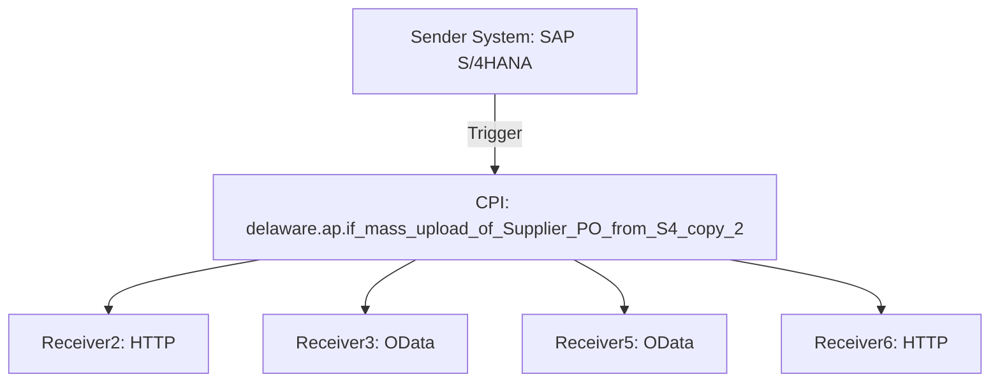

# High-level architecture

The iFlow `delaware.ap.if_mass_upload_of_Supplier_PO_from_S4_copy_2` is designed to facilitate the mass upload of Supplier Purchase Orders (POs) from an SAP S/4HANA system to various receiver systems. The architecture involves multiple components, including sender and receiver systems, message flows, and processing logic encapsulated in Groovy scripts and content modifiers.

# Purpose of this iFlow

The primary purpose of this iFlow is to automate the process of uploading Supplier Purchase Orders from SAP S/4HANA to external systems. It handles the extraction of relevant data, transformation, and delivery to multiple endpoints, ensuring that the data is correctly formatted and transmitted.

# Sender/Receiver systems

- **Sender System**: SAP S/4HANA
- **Receiver Systems**:
  - Receiver2 (HTTP)
  - Receiver3 (OData)
  - Receiver5 (OData)
  - Receiver6 (HTTP)

# Adapter types used

- **HTTP Adapter**: Used for sending requests to Receiver2 and Receiver6.
- **OData Adapter**: Used for interacting with Receiver3 and Receiver5 to perform CRUD operations on Supplier Purchase Orders.

# Step-by-step flow explanation

1. **Start Event**: The iFlow is triggered by a timer event that initiates the process at specified intervals.
2. **Service Tasks**: The flow includes multiple service tasks that handle requests to the receiver systems. Each service task is responsible for sending data to a specific receiver.
3. **Content Modifiers**: These are used to enrich the message with necessary properties and headers before sending it to the receivers.
4. **Groovy Scripts**: Several Groovy scripts are invoked to process the data, including generating linked keys and preparing email notifications.
5. **Exclusive Gateway**: The flow uses an exclusive gateway to route messages based on conditions evaluated from the message headers.
6. **End Events**: The flow concludes with multiple end events, indicating the completion of the process for different branches.

# Mapping logic summary

The iFlow utilizes various mapping techniques, primarily through Groovy scripts and content modifiers:

- **Content Modifiers**: Used to set properties like `LinkedSAPObjectKey`, `BusinessObjectTypeName`, and other relevant fields based on the incoming message structure.
- **Groovy Scripts**:
  - **script1.groovy**: Combines `SupplierInvoice` and `FiscalYear` to create a `LinkedSAPObjectKey`.
  - **script2.groovy**: Constructs a `LinkedSAPObjectKey` using `PurchaseOrder` and `PurchaseOrderItem`.
  - **script3.groovy**: Prepares an email payload with a PDF attachment for notification purposes.

# Groovy script explanations

1. **script1.groovy**: 
   - **Purpose**: Generates a `LinkedSAPObjectKey` by concatenating `SupplierInvoice` and `FiscalYear`.
   - **Usage**: This key is stored as a property for later use in the flow.

2. **script2.groovy**: 
   - **Purpose**: Constructs a `LinkedSAPObjectKey` using `PurchaseOrder` and `PurchaseOrderItem`.
   - **Usage**: The key is set as both a property and a header for debugging.

3. **script3.groovy**: 
   - **Purpose**: Processes the PDF bytes from the message body and prepares an email payload with the PDF attached.
   - **Usage**: Sends an email notification with the generated PDF to a specified recipient.

# Error handling

The iFlow incorporates error handling mechanisms by utilizing the `throwExceptionOnFailure` property in the HTTP adapter configurations. This ensures that any failures during the HTTP requests are captured and can be managed appropriately. Additionally, the flow can log errors based on the logging configuration set in the iFlow properties.

# Security/authentication

The iFlow employs various security mechanisms for authentication:

- **Basic Authentication**: Used for HTTP connections to Receiver2 and Receiver5.
- **OAuth2 Client Credentials**: Used for HTTP connections to Receiver6, ensuring secure access to the Microsoft Graph API for sending emails.
- **Credential Management**: Credentials are stored securely in the CPI environment and referenced by their names in the adapter configurations.

# High-Level Process Flow Diagram

