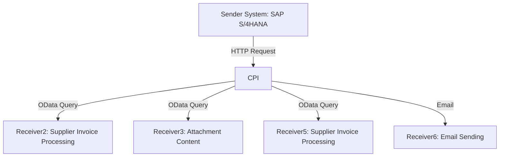

# Technical Documentation for iFlow: delaware.ap.if_mass_upload_of_Supplier_PO_from_S4_copy_2

## 1. High-level architecture
The iFlow integrates SAP S/4HANA with external systems to facilitate the mass upload of Supplier Purchase Orders (POs). It utilizes various adapters and processing steps to transform and route data between the sender and receiver systems.

## 2. Purpose of this iFlow
The primary purpose of this iFlow is to automate the process of uploading Supplier Purchase Orders from SAP S/4HANA to external systems. It handles the retrieval of relevant data, processes it, and sends it to designated endpoints, ensuring efficient data transfer and integration.

## 3. Sender/Receiver systems
- **Sender System**: SAP S/4HANA
- **Receiver Systems**:
  - Receiver2: External system for processing Supplier Invoice data.
  - Receiver3: External system for handling attachment content.
  - Receiver5: External system for Supplier Invoice processing.
  - Receiver6: External system for sending emails.

## 4. Adapter types used
- **HTTP Adapter**: Used for sending and receiving HTTP requests.
- **OData Adapter**: Utilized for querying and manipulating data in SAP S/4HANA.
- **Email Adapter**: Used for sending emails with attachments.

## 5. Step-by-step flow explanation
1. **Start Event**: Triggered by a timer event to initiate the iFlow.
2. **Service Tasks**: Multiple service tasks are executed to retrieve Supplier Invoice data and attachments from SAP S/4HANA.
3. **Content Modifiers**: Modify the message content and set necessary properties for further processing.
4. **Groovy Scripts**: Execute custom logic to generate linked keys and prepare email payloads.
5. **Routing**: Based on conditions, the flow routes to different processing paths.
6. **End Events**: Conclude the process after all tasks are completed.

## 6. Mapping logic summary
The iFlow employs several mapping techniques:
- **Content Modifiers**: Used to set properties and modify message content based on XPath expressions.
- **Groovy Scripts**: Custom scripts to concatenate properties and prepare data for email attachments.

## 7. Groovy script explanations
- **script1.groovy**: Combines the Supplier Invoice and Fiscal Year to create a LinkedSAPObjectKey and sets it as a property.
- **script2.groovy**: Constructs a LinkedSAPObjectKey using the Purchase Order and Purchase Order Item, storing it for further processing.
- **script3.groovy**: Prepares an email payload with the PDF attachment, setting headers and body content for sending via email.

## 8. Error handling
The iFlow is configured to handle errors gracefully by:
- Logging errors for monitoring and troubleshooting.
- Setting specific headers to indicate the status of the message (e.g., "X-EMAIL-STATUS").
- Utilizing the `throwExceptionOnFailure` property in HTTP adapters to manage connection issues.

## 9. Security/authentication
- **Basic Authentication**: Used for HTTP and OData adapters to authenticate requests to the SAP S/4HANA system.
- **OAuth2 Client Credentials**: Employed for sending emails via the Microsoft Graph API.
- **Credential Management**: Credentials are securely stored and referenced in the iFlow configuration.

## 10. High-Level Process Flow Diagram

