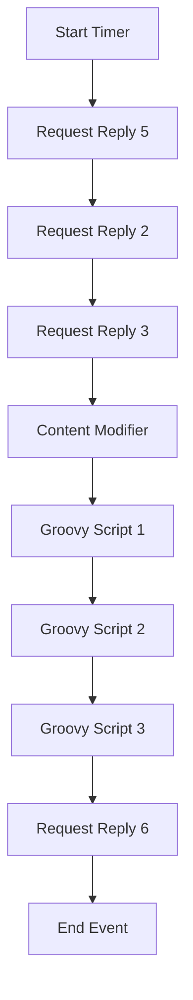

# Technical Documentation for iFlow: `delaware.ap.if_mass_upload_of_Supplier_PO_from_S4_copy_2`

## 1. High-level architecture
The iFlow `delaware.ap.if_mass_upload_of_Supplier_PO_from_S4_copy_2` integrates multiple systems using various adapters to facilitate the mass upload of Supplier Purchase Orders (PO) from SAP S/4HANA. It employs a combination of HTTP and OData protocols to communicate with external systems, ensuring seamless data transfer and processing.

## 2. Purpose of this iFlow
The primary purpose of this iFlow is to automate the mass upload of Supplier Purchase Orders from SAP S/4HANA to external systems. It processes incoming data, enriches it, and sends it to designated endpoints while handling attachments and notifications.

## 3. Sender/Receiver systems
- **Sender System**: SAP S/4HANA
- **Receiver Systems**:
  - Receiver2: External system for processing Supplier Invoices
  - Receiver3: External system for handling attachment content
  - Receiver5: External system for Supplier Invoice processing
  - Receiver6: Microsoft Graph API for sending email notifications

## 4. Adapter types used
- **HTTP Adapter**: Used for sending and receiving data via HTTP requests.
- **OData Adapter**: Utilized for querying and manipulating data in a RESTful manner.

## 5. Step-by-step flow explanation
1. **Start Event**: Triggered by a timer event to initiate the iFlow.
2. **Service Task (Request Reply 5)**: Queries Supplier Invoices from SAP S/4HANA using OData.
3. **Service Task (Request Reply 2)**: Retrieves attachment content from SAP S/4HANA.
4. **Service Task (Request Reply 3)**: Sends the retrieved data to Receiver2 for processing.
5. **Content Modifiers**: Enrich the message with necessary properties and headers.
6. **Groovy Scripts**: 
   - Script1: Generates `LinkedSAPObjectKey` from Supplier Invoice and Fiscal Year.
   - Script2: Constructs `LinkedSAPObjectKey` from Purchase Order and Item.
   - Script3: Prepares the email payload with PDF attachments for sending.
7. **Service Task (Request Reply 6)**: Sends email notifications with attachments to specified recipients.
8. **End Events**: Concludes the iFlow execution.

## 6. Mapping logic summary
The iFlow utilizes various content modifiers and Groovy scripts to map and transform data:
- **Content Modifiers**: Set properties such as `LinkedSAPObjectKey`, `BusinessObjectTypeName`, and other relevant fields.
- **Groovy Scripts**:
  - **Script1**: Combines Supplier Invoice and Fiscal Year to create a unique key.
  - **Script2**: Constructs a key from Purchase Order and Purchase Order Item.
  - **Script3**: Encodes PDF content and prepares the email structure.

## 7. Groovy script explanations
- **Script1**: Generates a `LinkedSAPObjectKey` by concatenating `SupplierInvoice` and `FiscalYear`. This key is essential for identifying the SAP object in subsequent processing.
- **Script2**: Constructs a `LinkedSAPObjectKey` using `PurchaseOrder` and `PurchaseOrderItem`, ensuring a unique identifier for each PO item.
- **Script3**: Processes the PDF attachment, encodes it in Base64, and prepares an email payload with the necessary details for sending via Microsoft Graph API.

## 8. Error handling
The iFlow is designed to handle errors gracefully by:
- Setting appropriate headers to indicate the status of the message (e.g., `X-EMAIL-STATUS`).
- Logging errors and exceptions for troubleshooting.
- Utilizing the `throwExceptionOnFailure` property in HTTP adapters to manage failures effectively.

## 9. Security/authentication
- **Authentication Method**: Basic authentication is used for OData and HTTP adapters, with credentials stored securely in the CPI environment.
- **OAuth2 Client Credentials**: Used for sending emails via Microsoft Graph API, ensuring secure access to the email service.
- **Credential Names**: Specific credential names are referenced in the iFlow configuration to ensure secure access to external systems.

## 10. High-Level Process Flow Diagram

This documentation provides a comprehensive overview of the iFlow `delaware.ap.if_mass_upload_of_Supplier_PO_from_S4_copy_2`, detailing its architecture, purpose, flow, and components involved in the integration process.
