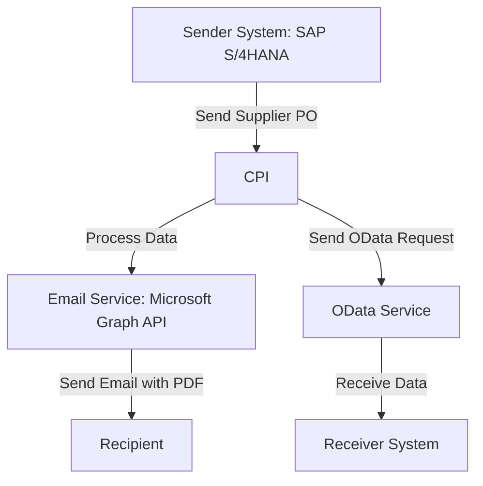

# Technical Documentation for iFlow: delaware.ap.if_mass_upload_of_Supplier_PO_from_S4_copy_2

## 1. High-level architecture
The iFlow integrates multiple systems, facilitating the upload of Supplier Purchase Orders (POs) from an SAP S/4HANA system to various receivers, including email and OData services. The architecture leverages SAP Cloud Platform Integration (CPI) to orchestrate the data flow and transformation.

## 2. Purpose of this iFlow
The primary purpose of this iFlow is to automate the mass upload of Supplier Purchase Orders from SAP S/4HANA to designated receivers. It processes incoming data, enriches it, and sends it to multiple endpoints, including email notifications with attached PDF documents.

## 3. Sender/Receiver systems
- **Sender System**: SAP S/4HANA
- **Receiver Systems**:
  - Email service (Microsoft Graph API)
  - OData services for Supplier Invoice processing

## 4. Adapter types used
- **HTTP Adapter**: Used for sending requests to the email service and OData endpoints.
- **OData Adapter**: Used for interacting with OData services to retrieve and send data.

## 5. Step-by-step flow explanation
1. **Start Event**: Triggered by a timer to initiate the iFlow.
2. **Service Tasks**: Multiple service tasks are executed to handle requests and responses to/from the sender and receiver systems.
3. **Content Modifiers**: Used to enrich the message with necessary headers and properties.
4. **Groovy Scripts**: Custom scripts are executed to manipulate message properties and prepare data for further processing.
5. **Exclusive Gateway**: Routes the flow based on conditions evaluated from message headers.
6. **End Events**: Concludes the process after all tasks are completed.

## 6. Mapping logic summary
The iFlow utilizes Groovy scripts for data transformation and mapping:
- **Script 1**: Combines `SupplierInvoice` and `FiscalYear` to create a `LinkedSAPObjectKey`.
- **Script 2**: Constructs a `LinkedSAPObjectKey` using `PurchaseOrder` and `PurchaseOrderItem`.
- **Script 3**: Prepares the email payload, including the PDF attachment, and sets the appropriate headers.

## 7. Groovy script explanations
- **Script 1**: 
  - Purpose: To create a unique key (`LinkedSAPObjectKey`) by concatenating `SupplierInvoice` and `FiscalYear`.
  - Usage: This key is used for identifying the related SAP object in subsequent processing.

- **Script 2**: 
  - Purpose: To generate a `LinkedSAPObjectKey` by concatenating `PurchaseOrder` with `PurchaseOrderItem`.
  - Usage: This key is stored as an exchange property for OData adapter usage.

- **Script 3**: 
  - Purpose: To construct the email payload with the PDF attachment and set the email headers.
  - Usage: This script is crucial for sending notifications with the attached Supplier PO PDFs.

## 8. Error handling
The iFlow is configured to handle errors gracefully. If any service task fails, the error is logged, and appropriate notifications can be sent to the responsible parties. The iFlow also includes mechanisms to return exceptions to the sender if configured.

## 9. Security/authentication
- **Authentication Method**: Basic authentication is used for the OData adapter, while OAuth2 Client Credentials are used for the email service.
- **Credentials**: 
  - For OData: `CPI User for SAP S4 HANA Cloud`
  - For Email: `MSGraph_SendMail_OAuth`
- **Configuration**: Credentials are securely stored in the CPI credential store and referenced in the iFlow configuration.

## 10. High-Level Process Flow Diagram

