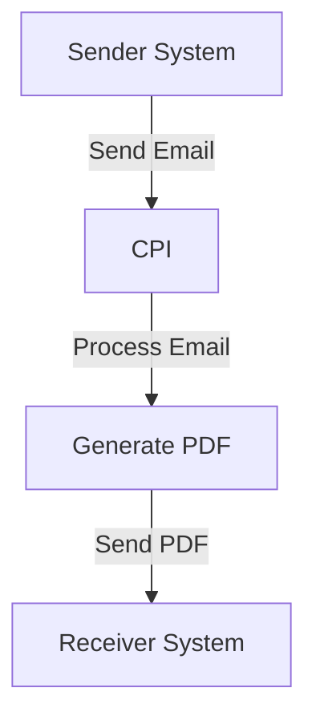

# Technical Documentation Report for iFlow 'new1'

## 1. High-level architecture
The iFlow 'new1' is designed to facilitate the integration between a sender system and a receiver system through SAP Cloud Platform Integration (CPI). It processes incoming email content, converts it into a PDF format, and sends it to the designated receiver. The architecture consists of the following components:
- **Sender System**: The source of incoming emails.
- **CPI**: The integration platform that processes the emails and generates PDFs.
- **Receiver System**: The destination for the generated PDF files.

## 2. Purpose of this iFlow
The primary purpose of the iFlow 'new1' is to receive email content, convert it into a PDF document, and send this document to a specified receiver. This automation streamlines the process of generating reports from emails, enhancing efficiency and reducing manual effort.

## 3. Sender/Receiver systems
- **Sender System**: An email server that sends emails containing the content to be converted into PDFs.
- **Receiver System**: A designated endpoint that receives the generated PDF files, which could be an email server or a file storage system.

## 4. Adapter types used
The iFlow utilizes the following adapter types:
- **Mail Adapter**: For receiving emails from the sender system.
- **HTTP/S Adapter**: For sending the generated PDF to the receiver system.

## 5. Step-by-step flow explanation
1. **Start Event**: The iFlow begins with a start event triggered by the arrival of an email.
2. **Content Modifier**: The content of the email is modified to prepare it for processing.
3. **Groovy Script Execution**: The Groovy script processes the email content, extracts the subject, and generates a PDF document.
4. **End Event**: The iFlow concludes after the PDF has been successfully sent to the receiver.

## 6. Mapping logic summary
The iFlow does not utilize XSLT for transformation; instead, it relies on the Groovy script to handle the mapping and transformation of the email content into a PDF format. The script reads the email body and subject, processes them, and creates a PDF document.

## 7. Groovy script explanations
The Groovy script (`script1.groovy`) performs the following functions:
- **Read Email Content**: It retrieves the body of the incoming email.
- **Extract Subject**: It extracts the email subject from the headers, providing a default value if none is found.
- **Clean Subject**: It sanitizes the subject to create a valid filename for the PDF.
- **Create PDF**: It defines a function to generate a PDF document from the email body using the iText library.
- **Return PDF Data Handler**: The script returns a DataHandler containing the generated PDF, which can be sent to the receiver.

## 8. Error handling
The iFlow is configured to not return exceptions to the sender, as indicated by the property `returnExceptionToSender` set to false. This means that any errors encountered during processing will not be communicated back to the sender system. Instead, error handling should be implemented within the Groovy script or through CPI's built-in error handling mechanisms.

## 9. Security/authentication
The iFlow does not enable basic authentication for the sender endpoint, as indicated by the property `enableBasicAuthentication` set to false. Security measures should be considered at the email server level and for the receiver endpoint to ensure that only authorized systems can send and receive data.

## 10. High-Level Process Flow Diagram

This documentation provides a comprehensive overview of the iFlow 'new1', detailing its architecture, purpose, components, and processing logic.
